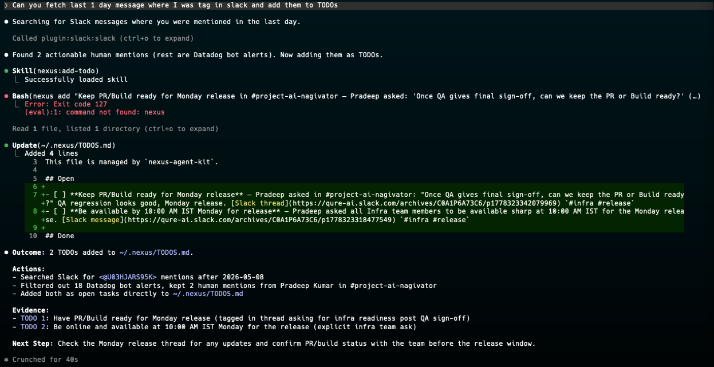
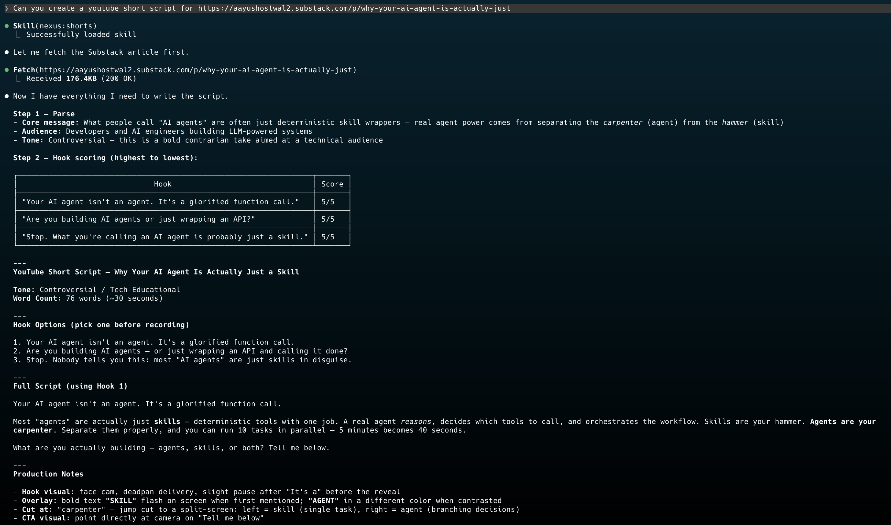

# Nexus Agent Kit

Nexus Agent Kit is a plugin-first AI terminal workspace for Codex and Claude Code. It packages reusable skills, specialized agents, terminal commands, and MCP safety conventions so your AI sessions behave consistently across planning, CI/CD debugging, code review, TODO tracking, infrastructure design, tutorials, and tool-connected work.

Instead of re-explaining how you want the assistant to operate in every new repo or terminal, you install Nexus once and get a shared operating model for engineering work.

## Connect

<p align="center">
  <a href="https://www.linkedin.com/in/aayush-ostwal/"></a>
  <a href="https://x.com/ostwal_aayush"></a>
  <a href="https://www.youtube.com/@AayushOstwal"></a>
  <a href="https://github.com/aayushostwal"></a>
  <a href="https://medium.com/@aayushostwal"></a>
  <a href="https://aayushostwal2.substack.com"></a>
</p>

<div align="center">
<p>I regularly write about AI, DevOps, Cloud Infrastructure, and Software Engineering. Subscribe to get practical guides, deep dives, and updates.</p>
<a href="https://aayushostwal2.substack.com/subscribe?next=https%3A%2F%2Fsubstack.com%2F%40aayushostwal2&utm_source=profile-page&utm_medium=web&utm_campaign=substack_profile&just_signed_up=true">

</a>
</div>

<div align="center">
<p>If this project is useful and you want to support more open-source AI engineering work, you can sponsor it on GitHub.</p>
<a href="https://github.com/sponsors/aayushostwal">
  
</a>
</div>

## Quick Start

### Install In Codex

Install directly from this GitHub repo:

```bash
npx codex-marketplace add aayushostwal/nexus --plugin --global
```

Project-scoped install:

```bash
npx codex-marketplace add aayushostwal/nexus --plugin --project
```

This is a direct repo install. Users need the repo slug `aayushostwal/nexus`; pushing this repo does not by itself make the plugin searchable in a central Codex marketplace index.

### Install In Claude Code

```text
/plugin marketplace add aayushostwal/nexus
/plugin install nexus@nexus-marketplace
/reload-plugins
```

## What Nexus Does In Your Terminal

Nexus is most valuable when the work is ambiguous, technical, or operationally risky. It gives your terminal assistant stronger defaults for coordination, exploration, planning, debugging, infrastructure design, review, and connected-tool workflows.

| Workflow | What Nexus actually improves |
| --- | --- |
| Coordination | Breaks complex work into a dependency graph, separates critical-path tasks from independent work, and routes subtasks to the right specialist agents for parallel execution where safe. |
| Exploration | Helps determine the right approach when the goal is known but the implementation path is still unclear, producing options, trade-offs, and a recommendation before detailed planning starts. |
| Planning | Converts vague feature requests, infra changes, and architecture ideas into structured implementation plans with scope, risk, dependencies, validation, and rollback thinking before code changes begin. |
| Debugging | Routes failures into the right debugging track so the assistant investigates root cause instead of guessing. |
| CI/CD debugging | Helps diagnose broken GitHub Actions, deploy failures, missing dependencies, environment drift, version mismatches, and pipeline regressions with a verify-the-fix workflow. |
| Codebase debugging | Works through failing tests, runtime exceptions, regressions, and app-level bugs using an evidence-first approach. |
| Framework and tooling debugging | Handles issues in frameworks, package managers, build tools, and local dev tooling by separating tool failures from app-code failures. |
| Review | Pushes code review toward bugs, regressions, missing tests, and operational risk instead of surface-level summaries. |
| Infrastructure design | Scans a codebase to detect app type, databases, queues, and auth — then produces a professional HLD with a Mermaid diagram, cost estimate, trade-off matrix, and deployment strategy for AWS, GCP, or Azure. |
| Infrastructure evaluation | Reads existing Terraform, Kubernetes, docker-compose, and CI/CD files, scores them against reliability, security, cost, and observability criteria, and produces a dual-timeline improvement plan. |
| Free infrastructure alternatives | Maps every paid cloud service to free, cheap, or self-hosted replacements with tier groupings, production-readiness ratings, and specific migration steps. |
| Daily execution | Maintains TODOs, builds daily briefs, and uses connected tools like Slack, Outlook, Jira, Notion, and AWS within approval-first safety rules. |

### Example Use Cases

- Coordinate a multi-agent implementation by identifying which tasks can run in parallel.
- Compare approaches for modifying an existing build, deployment, or architecture flow.
- Plan a production feature before implementation.
- Debug a failing CI pipeline after a dependency or config change.
- Investigate why a deploy works locally but fails in GitHub Actions.
- Review a branch for correctness and missing tests.
- Design a production AWS or GCP architecture from a codebase with a cost estimate and Mermaid HLD.
- Audit existing Terraform or Kubernetes setup for SPOFs, security gaps, and cost waste.
- Find free or self-hosted alternatives to Firebase, Heroku, Auth0, Datadog, and other paid services.
- Build a daily brief from TODOs and connected work systems.

## Agents

Nexus ships focused agent definitions that can be reused inside supported terminals.

| Agent | Category | Purpose |
| --- | --- | --- |
| [`nexus-coordinator`](agents/coordinator.md) |   | Decomposes work into a dependency graph, identifies parallel tasks, and routes subtasks to specialist agents. |
| [`nexus-explorer`](agents/explorer.md) |   | Compares viable approaches and recommends a path before detailed planning begins. |
| [`nexus-planner`](agents/planner.md) |   | Produces approval-first technical plans for production work. |
| [`nexus-debugger`](agents/debugger.md) |   | Investigates failures, identifies root cause, and verifies fixes. |
| [`nexus-reviewer`](agents/reviewer.md) |   | Reviews code and workflows for bugs, regressions, and risk. |
| [`nexus-todo-manager`](agents/todo-manager.md) |   | Maintains labeled global TODOs and keeps persistent follow-ups organized. |
| [`nexus-social-assistant`](agents/social-assistant.md) |   | Builds daily briefs from Slack, Outlook, Jira, and Nexus TODO context. |
| [`nexus-tutorial-architect`](agents/tutorial.md) |   | Creates executable tutorial notebooks and reproducible learning assets. |

## Skills

Skills are grouped below by role so it is easier to understand what the plugin actually adds to the terminal.

### Core Operations

| Skill | Category | Purpose |
| --- | --- | --- |
| [`nexus`](skills/nexus/SKILL.md) |  | Shared operating rules, TODO workflows, daily briefs, and MCP safety behavior. |

### Planning And Research

| Skill | Category | Purpose |
| --- | --- | --- |
| [`nexus-planning`](skills/planning/SKILL.md) |   | Turns an intended technical change into scope, ordered steps, dependencies, risks, validation, and rollout. |
| [`nexus-exploring`](skills/exploring/SKILL.md) |   | Determines the right approach when the goal is clear but the design or implementation strategy is still uncertain. |

### Infrastructure Planning

| Skill | Category | Purpose |
| --- | --- | --- |
| [`nexus-infra`](skills/infrastructure/SKILL.md) |   | Entry point for all infrastructure requests — routes to design, evaluate, or free-alternatives based on what the user needs. |
| [`nexus-infra-design`](skills/infrastructure/design.md) |   | Scans a codebase and produces a professional HLD with Mermaid diagram, component table, cost estimate, and trade-off matrix. |
| [`nexus-infra-evaluate`](skills/infrastructure/evaluate.md) |   | Reads existing Terraform, K8s, docker-compose, and CI/CD files to produce a full audit report with short-term and long-term improvement plans. |
| [`nexus-infra-free-alternatives`](skills/infrastructure/free-alternatives.md) |   | Maps every paid cloud service to free, cheap, or self-hosted alternatives grouped by tier, with migration notes per service. |

### Debugging

| Skill | Category | Purpose |
| --- | --- | --- |
| [`nexus-debugging`](skills/debugging/SKILL.md) |  | Investigates failures and regressions with root-cause analysis, narrow fixes, verification, and prevention guidance. |
| [`debugging-common`](skills/debugging/common.md) |  | Shared debugging rules, output patterns, and checklists. |
| [`debugging-ci-cd`](skills/debugging/ci-cd.md) |   | CI/CD-focused debugging playbook. |
| [`debugging-codebase`](skills/debugging/codebase.md) |   | Application and code regression debugging playbook. |
| [`debugging-frameworks`](skills/debugging/frameworks.md) |   | Framework and tooling-specific debugging playbook. |

### Education And Documentation

| Skill | Category | Purpose |
| --- | --- | --- |
| [`nexus-tutorial`](skills/tutorial/SKILL.md) |   | Creates executable Jupyter-style tutorials with reproducible setup. |
| [`skill-writer`](skills/skill-writer.md/SKILL.md) |   | Helps create or improve new `SKILL.md` workflows. |

### Content And Social

| Skill | Category | Purpose |
| --- | --- | --- |
| [`nexus-shorts`](skills/shorts/SKILL.md) |   | Converts ideas, notes, or technical content into YouTube Shorts scripts. |

## Commands

| Command | Category | Purpose |
| --- | --- | --- |
| [`/add-todo`](commands/add-todo.md) |   | Add a classified item to the Nexus TODO system. |
| [`/daily-brief`](commands/daily-brief.md) |   | Build a daily brief from TODOs and configured tools. |
| [`/review-branch`](commands/review-branch.md) |   | Review current branch changes with findings first. |

## Tool Setup Guides

Nexus is designed to work well with MCP-connected tools, but it does not ship credentials or external accounts.

| Tool | Guide | What it adds to Nexus |
| --- | --- | --- |
| [Microsoft / Outlook](docs/tools/microsoft.md) | Microsoft Graph setup and permission guidance. | Mail and calendar context for daily briefs and workflow assistance. |
| [Slack](docs/tools/slack.md) | Slack MCP connection and token scope guidance. | Workspace search, channel context, thread retrieval, and approved messaging workflows. |
| [Notion](docs/tools/notion.md) | Notion MCP and internal integration setup guidance. | Access to pages, databases, and workspace knowledge. |
| [Jira / Atlassian](docs/tools/jira.md) | Atlassian Rovo MCP and API token setup guidance. | Issue, sprint, board, and project context for engineering workflows. |
| [AWS](docs/tools/aws.md) | AWS profile, role, and least-privilege MCP guidance. | Cloud status, logs, metrics, and infrastructure context with approval gates for changes. |

Safety defaults used by the repo:

- Read-only by default.
- Ask before sending messages, email, Jira updates, or cloud changes.
- Keep secrets out of git.
- Prefer scoped credentials, OAuth, or temporary tokens.

### How To Extend Nexus

1. Pick the tool you want to connect.
2. Open the matching setup guide in `docs/tools/`.
3. Configure the MCP connection or provider credentials outside git.
4. Start with read-only access.
5. Only add write permissions when your workflow actually needs them.
6. Keep Nexus approval-first for any external write, send, deploy, or update action.

## Usage In Real Life

| Title | Labels | Screenshots |
| --- | --- | --- |
| Slack TODO Aggregator |    |  |
| Article to Instagram Short Script Conversion |    |  |

## Development

Run the local checks with:

```bash
npm run lint
npm test
npm pack --dry-run
```

Install the pre-commit hook with:

```bash
npm run hooks:install
```

Version sync keeps these files aligned with `package.json`:

- `.agents/plugins/marketplace.json`
- `.codex-plugin/plugin.json`
- `.claude-plugin/plugin.json`
- `.claude-plugin/marketplace.json`

If you need to re-sync manually:

```bash
node scripts/sync-versions.js
```

## License

This project is licensed under the MIT License. See [LICENSE](LICENSE) for the full text.

## SEO / GEO Tags

`codex plugin`, `claude code plugin`, `ai terminal workflow`, `developer ai assistant`, `ci cd debugging`, `github actions debugging`, `terminal agents`, `mcp tools`, `model context protocol`, `ai coding workflow`, `engineering planning`, `developer productivity`, `prompt engineering`, `tool-connected ai`, `slack mcp`, `notion mcp`, `jira mcp`, `aws mcp`, `ai todo manager`, `daily brief automation`, `cloud infrastructure planning`, `aws architecture design`, `gcp architecture`, `azure architecture`, `infrastructure as code review`, `terraform audit`, `kubernetes review`, `hld generator`, `cloud cost estimation`, `free firebase alternative`, `free heroku alternative`, `supabase`, `render railway flyio`, `self-hosted cloud`, `infrastructure skills`, `devops ai assistant`
