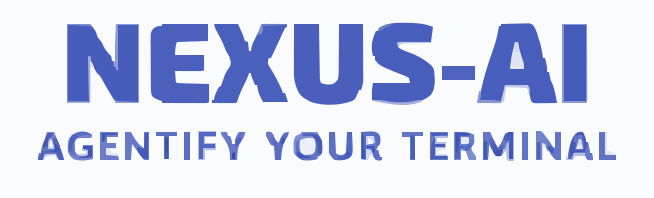

# Nexus Agent Kit

<p align="center">
  
</p>

Nexus Agent Kit is a plugin-first AI terminal workspace for Codex and Claude Code. It packages reusable skills, terminal commands, and MCP safety conventions so your AI sessions behave consistently across planning, CI/CD debugging, code review, TODO tracking, infrastructure design, tutorials, and tool-connected work.

Instead of re-explaining how you want the assistant to operate in every new repo or terminal, you install Nexus once and get a shared operating model for engineering work.

## Connect

<p align="center">
  <a href="https://nexus-ai.aayushostwal.com/"></a>
  <a href="https://www.linkedin.com/in/aayush-ostwal/"></a>
  <a href="https://x.com/ostwal_aayush"></a>
  <a href="https://www.youtube.com/@AayushOstwal"></a>
  <a href="https://github.com/aayushostwal"></a>
  <a href="https://medium.com/@aayushostwal"></a>
  <a href="https://aayushostwal2.substack.com"></a>
</p>

<div align="center">
<p>I regularly write about AI, DevOps, Cloud Infrastructure, and Software Engineering. Subscribe to get practical guides, deep dives, and updates.</p>
<a href="https://aayushostwal2.substack.com/subscribe?next=https%3A%2F%2Fsubstack.com%2F%40aayushostwal2&utm_source=profile-page&utm_medium=web&utm_campaign=substack_profile&just_signed_up=true">

</a>
</div>

<div align="center">
<p>If this project is useful and you want to support more open-source AI engineering work, you can sponsor it on GitHub.</p>
<a href="https://github.com/sponsors/aayushostwal">
  
</a>
</div>

## Quick Start

Nexus is distributed as a git-based plugin marketplace. There is no npm package: the bundled Node scripts are dependency-free and run with plain `node` (Node 18 or newer), so no `npm install` is ever needed.

### Install In Codex

Install directly from this GitHub repo using the third-party `codex-marketplace` tool:

```bash
npx codex-marketplace add aayushostwal/nexus --plugin --global
```

Project-scoped install:

```bash
npx codex-marketplace add aayushostwal/nexus --plugin --project
```

This is a direct repo install. Users need the repo slug `aayushostwal/nexus`; pushing this repo does not by itself make the plugin searchable in a central Codex marketplace index.

After install, Nexus automatically bootstraps global instruction files on first active plugin run:

- Claude runtime: updates `~/.claude/CLAUDE.md`
- Codex runtime: updates `~/.codex/AGENT.md`

If these files already exist, Nexus appends/updates only its managed block and preserves your existing content.

### Install In Claude Code

```text
/plugin marketplace add aayushostwal/nexus
/plugin install nexus@nexus-marketplace
/reload-plugins
```

After plugin enablement, run `node scripts/bootstrap-agent-docs.js` once from the cloned or installed plugin directory (plain `node`, no dependencies to install) to create or refresh the managed skills-first instruction block in your runtime instruction files.

## What Nexus Does In Your Terminal

- Coordinate a multi-agent implementation by identifying which tasks can run in parallel.
- Compare approaches for modifying an existing build, deployment, or architecture flow.
- Plan a production feature before implementation.
- Debug a failing CI pipeline after a dependency or config change.
- Investigate why a deploy works locally but fails in GitHub Actions.
- Review a branch for correctness and missing tests.
- Design a production AWS or GCP architecture from a codebase with a cost estimate and Mermaid HLD.
- Audit existing Terraform or Kubernetes setup for SPOFs, security gaps, and cost waste.
- Find free or self-hosted alternatives to Firebase, Heroku, Auth0, Datadog, and other paid services.
- Build a daily brief from TODOs and connected work systems.

## Skills

Skills are grouped below by role so it is easier to understand what the plugin actually adds to the terminal.

### Core Operations

| Skill | Category | Purpose |
| --- | --- | --- |
| [`nexus`](skills/nexus/SKILL.md) |  | Shared operating rules, TODO workflows, daily briefs, and MCP safety behavior. |

### Debugging

| Skill | Category | Purpose |
| --- | --- | --- |
| [`nexus-debugging`](skills/debugging/SKILL.md) |  | Investigates failures and regressions with root-cause analysis, narrow fixes, verification, and prevention guidance. |
| [`debugging-common`](skills/debugging/common.md) |  | Shared debugging rules, output patterns, and checklists. |
| [`debugging-ci-cd`](skills/debugging/ci-cd.md) |   | CI/CD-focused debugging playbook. |
| [`debugging-codebase`](skills/debugging/codebase.md) |   | Application and code regression debugging playbook. |
| [`debugging-frameworks`](skills/debugging/frameworks.md) |   | Framework and tooling-specific debugging playbook. |

### Testing

| Skill | Category | Purpose |
| --- | --- | --- |
| [`nexus-testing`](skills/testing/SKILL.md) |   | Identifies why tests fail intermittently and produces targeted fixes rather than retry wrappers. |

### Reliability And Release

| Skill | Category | Purpose |
| --- | --- | --- |
| [`nexus-reliability`](skills/reliability/SKILL.md) |   | Works through an active incident with structured triage, blast radius assessment, and resolution guidance. |
| [`nexus-release-readiness`](skills/reliability/release-readiness.md) |   | Checks a release candidate against rollback readiness, monitoring coverage, and known risk factors before shipping. |

### Observability

| Skill | Category | Purpose |
| --- | --- | --- |
| [`nexus-observability`](skills/observability/SKILL.md) |   | Correlates error spikes, latency anomalies, and log patterns across services to surface the most likely failure origin. |

### Performance

| Skill | Category | Purpose |
| --- | --- | --- |
| [`nexus-performance`](skills/performance/SKILL.md) |  | Entry point for all performance requests — routes to memory, dependency, or profiling tracks based on the symptom. |
| [`performance-memory-leak`](skills/performance/memory-leak.md) |   | Instruments a running process, identifies allocation hot paths, and confirms the fix eliminated the leak. |
| [`performance-dependency-blast-radius`](skills/performance/dependency-blast-radius.md) |   | Maps which modules are affected by a dependency upgrade before the upgrade is applied. |

### Education And Documentation

| Skill | Category | Purpose |
| --- | --- | --- |
| [`nexus-tutorial`](skills/tutorial/SKILL.md) |   | Creates executable Jupyter-style tutorials with reproducible setup. |
| [`skill-writer`](skills/skill-writer/SKILL.md) |   | Helps create or improve new `SKILL.md` workflows. |

### Content And Social

| Skill | Category | Purpose |
| --- | --- | --- |
| [`nexus-shorts`](skills/shorts/SKILL.md) |   | Converts ideas, notes, or technical content into YouTube Shorts scripts. |

### Token Efficiency

| Skill | Category | Purpose |
| --- | --- | --- |
| [`nexus-token-optimizer`](skills/token-optimizer/SKILL.md) |  | Always-on token optimization rules for efficient context gathering, tool usage, and concise responses. |

## Agents

Agents are autonomous subagents that Claude Code can delegate to. They run in their own context window with a focused system prompt and a restricted tool set. Every Nexus agent has persistent memory (`user` or `project` scope) so it learns your conventions across sessions, and a display color grouped by domain.

### Product (purple)

| Agent | Memory | Purpose |
| --- | --- | --- |
| [`prd-writer-critic`](agents/prd-writer-critic.md) | user | Writes PRDs from rough notes using a 10-section template with hard KPI/JTBD gates, or critiques existing PRDs with severity-ranked gaps. |
| [`roadmap-planner`](agents/roadmap-planner.md) | user | Turns an intended change into a scoping table, ordered steps with verify commands, risks, and rollback plans — hard-stops for approval before any implementation detail. |

### Design (pink)

| Agent | Memory | Purpose |
| --- | --- | --- |
| [`uiux-reviewer`](agents/uiux-reviewer.md) | user | Read-only UI/UX review: heuristics, WCAG 2.2 AA accessibility, state coverage, and responsive behavior, with impact-calibrated severity. |
| [`mobile-ux-designer`](agents/mobile-ux-designer.md) | user | Designs and reviews mobile UX across iOS/Android/cross-platform: navigation, touch ergonomics, offline states, permission choreography. |

### Architecture (blue)

| Agent | Memory | Purpose |
| --- | --- | --- |
| [`system-architecture-reviewer`](agents/system-architecture-reviewer.md) | project | Maps service boundaries, coupling, and extraction candidates; issues GO/NO-GO deployment safety verdicts with T1–T5 risk tiers. |
| [`scalability-planner`](agents/scalability-planner.md) | project | Bottleneck-ordered scaling plans with explicit capacity math and tiered triggers — boring solutions first, sharding last. |

### Data & Events (orange)

| Agent | Memory | Purpose |
| --- | --- | --- |
| [`database-architect`](agents/database-architect.md) | project | Schema design, index strategy from real query plans, and zero-downtime expand–contract migrations with per-step rollback. |
| [`event-driven-designer`](agents/event-driven-designer.md) | project | Designs and reviews async systems: idempotency, ordering costs, outbox, sagas, DLQ replay, and schema evolution. |

### Cloud (yellow)

| Agent | Memory | Purpose |
| --- | --- | --- |
| [`cloud-cost-optimizer`](agents/cloud-cost-optimizer.md) | user | Cost audits from real billing data and live-verified pricing — never from memory. Quick wins, structural changes, and monitoring setup. |
| [`iac-engineer`](agents/iac-engineer.md) | project | Designs and writes Terraform/CDK, audits existing IaC with evidence-cited findings, produces HLDs with verified cost tables. |

### Code & Docs (green / red)

| Agent | Memory | Purpose |
| --- | --- | --- |
| [`codebase-explorer`](agents/codebase-explorer.md) | project | Token-efficient codebase navigation; returns a three-column map (Title, File path, Description) consumable by humans and downstream agents. |
| [`code-reviewer`](agents/code-reviewer.md) | project | Read-only senior reviewer for a PR, branch, or diff. Returns a verdict with file:line findings covering correctness, regressions, security, migration risk, and deploy safety. |
| [`docs-app-builder`](agents/docs-app-builder.md) | project | Builds documentation as a React app: Diátaxis-organized sidebar navigation, Mermaid diagrams, reference tables, search, tabs, and dark mode — verified by a passing build and link crawl. |

### AI (cyan)

| Agent | Memory | Purpose |
| --- | --- | --- |
| [`ai-product-engineer`](agents/ai-product-engineer.md) | user | Builds LLM-powered features end-to-end: model selection, cost projections, RAG and agent design, evals as the core loop, production failure modes. |

## Commands

| Command | Category | Purpose |
| --- | --- | --- |
| [`/add-todo`](commands/add-todo.md) |   | Add a classified item to the Nexus TODO system. |
| [`/daily-brief`](commands/daily-brief.md) |   | Build a daily brief from TODOs and configured tools. |
| [`/review-branch`](commands/review-branch.md) |   | Review current branch changes with findings first. |
| [`/stats`](commands/stats.md) |  | Show token usage and estimated cost stats for Claude and Codex sessions. |

## Tool Setup Guides

Nexus is designed to work well with MCP-connected tools, but it does not ship credentials or external accounts.

| Tool | Guide | What it adds to Nexus |
| --- | --- | --- |
| [Microsoft / Outlook](docs/tools/microsoft.md) | Microsoft Graph setup and permission guidance. | Mail and calendar context for daily briefs and workflow assistance. |
| [Slack](docs/tools/slack.md) | Slack MCP connection and token scope guidance. | Workspace search, channel context, thread retrieval, and approved messaging workflows. |
| [Notion](docs/tools/notion.md) | Notion MCP and internal integration setup guidance. | Access to pages, databases, and workspace knowledge. |
| [Jira / Atlassian](docs/tools/jira.md) | Atlassian Rovo MCP and API token setup guidance. | Issue, sprint, board, and project context for engineering workflows. |
| [AWS](docs/tools/aws.md) | AWS profile, role, and least-privilege MCP guidance. | Cloud status, logs, metrics, and infrastructure context with approval gates for changes. |

Safety defaults used by the repo:

- Read-only by default.
- Ask before sending messages, email, Jira updates, or cloud changes.
- Keep secrets out of git.
- Prefer scoped credentials, OAuth, or temporary tokens.

### How To Extend Nexus

1. Pick the tool you want to connect.
2. Open the matching setup guide in `docs/tools/`.
3. Configure the MCP connection or provider credentials outside git.
4. Start with read-only access.
5. Only add write permissions when your workflow actually needs them.
6. Keep Nexus approval-first for any external write, send, deploy, or update action.

## Usage In Real Life

| Title | Labels | Screenshots |
| --- | --- | --- |
| Slack TODO Aggregator |    |  |
| Article to Instagram Short Script Conversion |    |  |

## Development

The scripts are dependency-free, so local checks run with the built-in Node test runner:

```bash
node --test
```

Plugin packaging lives in:

- `.agents/plugins/marketplace.json`
- `.codex-plugin/plugin.json`
- `.claude-plugin/plugin.json`
- `.claude-plugin/marketplace.json`

## License

This project is licensed under the MIT License. See [LICENSE](LICENSE) for the full text.

## SEO / GEO Tags

`codex plugin`, `claude code plugin`, `ai terminal workflow`, `developer ai assistant`, `ci cd debugging`, `github actions debugging`, `terminal agents`, `mcp tools`, `model context protocol`, `ai coding workflow`, `engineering planning`, `developer productivity`, `prompt engineering`, `tool-connected ai`, `slack mcp`, `notion mcp`, `jira mcp`, `aws mcp`, `ai todo manager`, `daily brief automation`, `cloud infrastructure planning`, `aws architecture design`, `gcp architecture`, `azure architecture`, `infrastructure as code review`, `terraform audit`, `kubernetes review`, `hld generator`, `cloud cost estimation`, `free firebase alternative`, `free heroku alternative`, `supabase`, `render railway flyio`, `self-hosted cloud`, `infrastructure skills`, `devops ai assistant`
