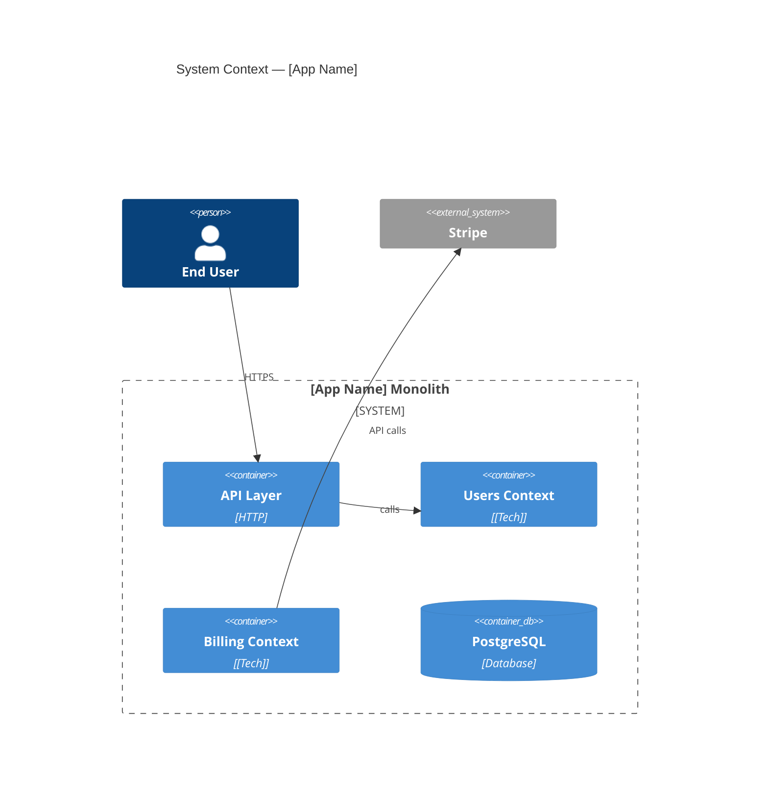

# Nexus Architecture Mapper

Map internal structure, identify bounded contexts, score coupling, and produce an extraction plan or deployment safety verdict.

---

## Compatibility
- Sub-skills: `skills/architecture/deployment-safety.md`
- Supporting files: `checklists/architecture-checklist.md`, `heuristics/architecture-heuristics.md`, `anti-patterns/common-mistakes.md`, `validation/output-validation.md`
- Required tools: Read, Grep, Glob, Bash
- Output: Mermaid C4 diagram + coupling matrix + extraction candidates + risk assessment
- Hands off to: `nexus:planning` when user approves extraction plan

---

## Routing

| User Intent | Track |
|-------------|-------|
| "Map this codebase", "what calls what", "bounded contexts", "architecture review" | Architecture Mapping (Steps 1–5) |
| "Is this deployment safe", "what breaks if I deploy", "pre-deployment check" | Route to `deployment-safety.md` |
| Both | Run Architecture Mapping first, then deployment-safety.md |

---

## Context Acquisition

| Signal | Where to look |
|--------|--------------|
| Directory structure | `find . -type d -not -path '*/.*' -not -path '*/node_modules/*' -not -path '*/__pycache__/*'` |
| Entry points | Main application bootstrap files (e.g. `main.*`, `app.*`, `server.*`, `index.*`) |
| Import graph | Language-appropriate grep for import/require statements across source files |
| API surface | Route/handler definitions — look for patterns matching the framework's routing convention |
| Database schema | Migration files, schema definitions, ORM model files, raw SQL |
| Shared state | Global singletons, shared caches, cross-module DB models, env config objects |
| Package boundaries | Package manifest files (e.g. `package.json`, `pyproject.toml`, `go.mod`, `Cargo.toml`) |

If information is missing: ask one targeted question ("Where are the route definitions?").

---

## Mapping Workflow

### Step 1 — Layer Classification

| Layer | What belongs here |
|-------|------------------|
| **API / Interface** | HTTP handlers, GraphQL resolvers, CLI commands | `routes/`, `api/`, `controllers/` |
| **Service / Domain** | Business logic, use cases, orchestration | `services/`, `domain/`, `core/` |
| **Data / Persistence** | ORM models, repositories, migrations | `models/`, `repositories/`, `db/` |
| **Infrastructure** | Queue clients, S3, email, external APIs | `infra/`, `adapters/`, `clients/` |
| **Shared / Util** | Logging, auth, config, middleware | `shared/`, `utils/`, `middleware/` |
| **Worker / Background** | Async tasks, cron jobs, event consumers | `tasks/`, `workers/`, `jobs/` |

Flag any directory that spans multiple layers — that is a coupling signal.

### Step 2 — Dependency Graph

For each module, count fan-in (who imports it) and fan-out (who it imports):

| Module | Fan-in | Fan-out | Risk if extracted |
|--------|--------|---------|-------------------|
| `shared/models` | 12 | 0 | Critical — extract last |
| `users/` | 8 | 3 | High — 8 callers |
| `billing/` | 2 | 5 | Low — 2 callers |

Rules:
- Fan-in > 5 = high extraction risk
- Fan-in = 0 = leaf module — extract first
- Imports from `shared/models` or `shared/db` across domain boundaries = shared database anti-pattern

### Step 3 — Bounded Context Identification

A bounded context: changes together, owns its data, has coherent domain vocabulary, has a clear interface.

```bash
git log --name-only --pretty=format: | grep -v '^$' | sort | uniq -c | sort -rn | head -40
```

Files that always commit together belong in the same context.

Tests:
- Can this context be described in one sentence without mentioning another context's concepts?
- Does this context own all the DB tables it needs, or does it read another context's tables directly?
- If extracted, what would it need to call back to the monolith for?

### Step 4 — Coupling Matrix

| From \ To | Users | Billing | Notifications | Score |
|-----------|-------|---------|---------------|-------|
| Users | — | Direct DB read | Function call | Medium |
| Billing | Foreign key | — | Event | High |

Coupling types (worst → best):
1. **Shared database table** — two contexts write to the same table
2. **Shared ORM model** — two contexts import the same model class
3. **Direct function call** — synchronous in-process call
4. **Shared config** — both contexts read the same config object
5. **REST/HTTP call** — synchronous but service-like
6. **Async event / message** — loosely coupled

Flag shared-database coupling as a **false boundary**.

### Step 5 — Architecture Output

#### 5a. Mermaid C4 Context Diagram



#### 5b. Coupling Matrix

```
| Context       | Score (0-10) | Coupled To     | Type                        |
|---------------|--------------|----------------|-----------------------------|
| Notifications | 2            | Users          | Function call               |
| Orders        | 5            | Users, Billing | Direct call + shared model  |
| Billing       | 7            | Users, Orders  | Shared DB + FK              |
| Users         | 8            | Everything     | Shared DB model             |
```

#### 5c. Extraction Candidates (ordered, leaves first)

```
1. Notifications — score 2, 0 downstream deps, owns its tables
   Risk: Low | Effort: 1-2 sprints | Blocker: Email provider config must move with it
2. Orders — score 5, depends on Users (sync call acceptable)
   Risk: Medium | Effort: 2-4 sprints | Blocker: Shared order_items table with Billing
3. Billing — score 7, deeply coupled to Users via shared DB
   Risk: High | Effort: 4-8 sprints | Blocker: Shared DB tables must be split first
4. Users — score 8, the core — extract last
   Risk: Critical | Effort: 8-12 sprints | Blocker: All others must be extracted first
```

---

## Strangler Fig Planning

Use when: monolith is in production, extraction must be incremental, team wants parallel rollout.

```
Phase 1 — Facade (Week 1-2):     Add HTTP proxy. 100% traffic to monolith. No behaviour change.
Phase 2 — Dark Launch (W 3-4):   Stand up new service. Mirror traffic but never serve responses. Fix divergences.
Phase 3 — Canary (W 5-6):        Route 5% → 25% → 50% → 75%. Monitor errors, latency, consistency.
Phase 4 — Cutover (W 7):         100% to new service. Keep monolith code for 30 days as rollback.
Phase 5 — Cleanup (W 8+):        Delete monolith code path. Remove facade. Decommission module.
```

Do not attempt big-bang extraction when coupling score > 7, shared DB tables exist, or no integration tests cover the boundary.

---

## Output Contract

```
## Architecture Map: [App Name]

### Layer Map
[Layer table from Step 1]

### Dependency Graph (top 10 by fan-in)
[Dependency table from Step 2]

### Bounded Contexts Identified
[Candidate list from Step 3]

### Coupling Matrix
[Matrix from Step 4]

### Extraction Candidates (ordered)
[Ordered list from Step 5c]

### Architecture Diagram
[Mermaid C4 from Step 5a]

### Risk Assessment
| Context | Extraction Risk | Primary Blocker |
|---------|----------------|-----------------|
| [name]  | Low/Med/High   | [specific blocker] |

### Recommended Next Step
[One concrete action — e.g. "Extract Notifications first using strangler fig. Start with Phase 1 facade."]
```

---

## Anti-Patterns

Read `anti-patterns/common-mistakes.md` before writing any recommendations.

- Never identify boundaries by team structure alone — domains trump org charts
- Never recommend extracting a context with a shared DB table without resolving the shared table first
- Never produce a coupling matrix without verifying actual import relationships
- Never skip extraction order — extracting high-fan-in modules first causes cascading failures
- Never recommend microservices for a system with fewer than 3-5 engineers
- Never mark a context as a true boundary if it imports models from another context
