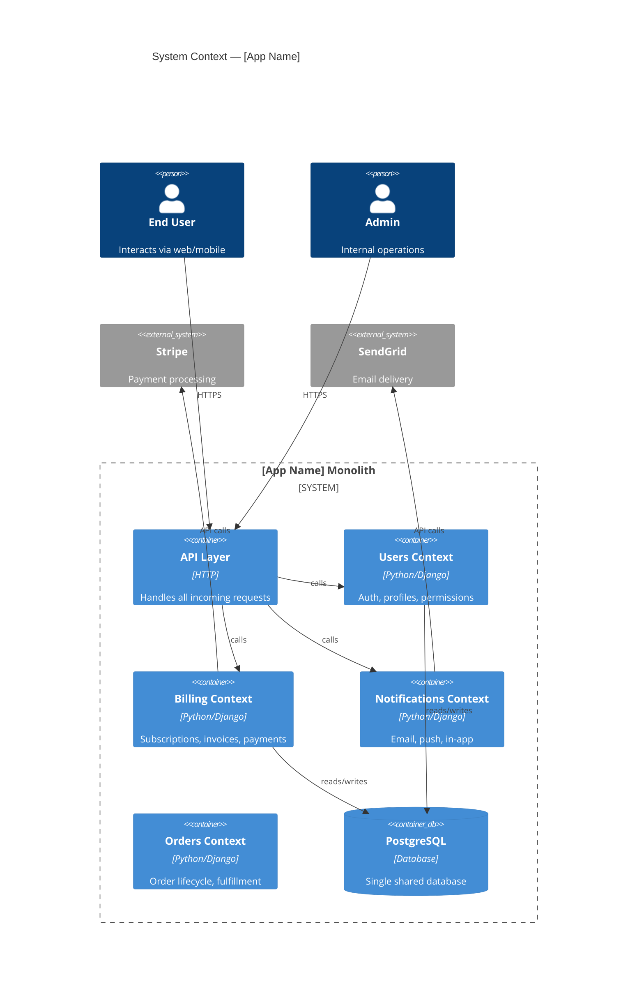

# Nexus Architecture Mapper

Map a codebase's internal structure, identify bounded contexts, score coupling, and produce an
actionable extraction plan or deployment safety verdict.

---

## Compatibility
- Sub-skills: `skills/architecture/deployment-safety.md`
- Supporting files: `checklists/architecture-checklist.md`, `heuristics/architecture-heuristics.md`,
  `anti-patterns/common-mistakes.md`, `validation/output-validation.md`
- Required tools: Read, Grep, Glob, Bash
- Output: Mermaid C4 diagram + coupling matrix + extraction candidates + risk assessment
- Hands off to: `nexus:planning` when the user approves an extraction plan

---

## Routing

| User Intent | Track |
|-------------|-------|
| "Map this codebase", "what calls what", "bounded contexts", "architecture review" | Architecture Mapping (Steps 1–5 below) |
| "Is this deployment safe", "what breaks if I deploy", "pre-deployment check" | Route to `deployment-safety.md` |
| Both in one request | Run Architecture Mapping first; then deployment-safety.md for the specific change |

---

## Context Acquisition

Before mapping anything, collect:

| Signal | Where to look |
|--------|--------------|
| Directory structure | `find . -type d -not -path '*/.*' -not -path '*/node_modules/*' -not -path '*/__pycache__/*'` |
| Entry points | `main.py`, `app.py`, `index.ts`, `server.go`, `manage.py`, `wsgi.py`, `asgi.py` |
| Import graph | `grep -r "from \|import " --include="*.py" -h` or `grep -r "require\|import" --include="*.ts"` |
| API surface | Route definitions — `@app.route`, `router.get`, `@Controller`, `urlpatterns` |
| Database schema | Migration files, `models.py`, `schema.prisma`, `*.sql`, entity classes |
| Shared state | Global singletons, shared caches, cross-module DB models, environment config objects |
| Config / env | `.env.example`, `settings.py`, `config.yaml`, `application.yml` |
| Package boundaries | `pyproject.toml`, `package.json` workspaces, `go.mod`, `Cargo.toml` |

If information is missing: ask one targeted question ("Where are the route definitions?" not "Describe your codebase").

---

## Mapping Workflow

### Step 1 — Codebase Scan: Identify Layers

Read the directory structure and entry points. Classify every top-level directory and package
into one of these architectural layers:

| Layer | What belongs here | Examples |
|-------|------------------|---------|
| **API / Interface** | HTTP handlers, GraphQL resolvers, CLI commands, gRPC endpoints | `routes/`, `api/`, `controllers/`, `handlers/` |
| **Service / Domain** | Business logic, domain rules, use cases, orchestration | `services/`, `domain/`, `usecases/`, `core/` |
| **Data / Persistence** | ORM models, repositories, migrations, raw SQL | `models/`, `repositories/`, `db/`, `migrations/` |
| **Infrastructure** | Queue clients, S3, email, external APIs, caches | `infra/`, `adapters/`, `clients/`, `integrations/` |
| **Shared / Util** | Cross-cutting concerns — logging, auth, config, middleware | `shared/`, `utils/`, `middleware/`, `common/` |
| **Worker / Background** | Async tasks, cron jobs, event consumers | `tasks/`, `workers/`, `jobs/`, `consumers/` |

Produce a layer map:
```
Layer Map:
  API:      [directories]
  Service:  [directories]
  Data:     [directories]
  Infra:    [directories]
  Shared:   [directories]
  Workers:  [directories]
```

Flag any directory that does not fit a single layer — that is a coupling signal.

### Step 2 — Dependency Graph: Who Imports Whom

For each module/package identified in Step 1, count:

- **Fan-out** (outgoing deps): how many other modules does this module import?
- **Fan-in** (incoming deps): how many other modules import this module?

Build the dependency table:

| Module | Fan-in | Fan-out | Most-depended-on by | Risk if extracted |
|--------|--------|---------|--------------------|--------------------|
| `users/` | 8 | 3 | auth, billing, notifications | High — 8 callers |
| `billing/` | 2 | 5 | api, workers | Low — 2 callers |
| `notifications/` | 4 | 2 | users, billing | Medium |
| `shared/models` | 12 | 0 | everything | Critical — extract last |

Rules:
- Fan-in > 5 = high extraction risk — this module is depended on by too many callers to extract safely
- Fan-in = 0 = leaf module — extract first (no callers to update)
- Imports from `shared/models` or `shared/db` across domain boundaries = shared database anti-pattern

### Step 3 — Bounded Context Identification

A bounded context is a cluster of modules that:
1. Change together (co-commit frequently)
2. Own their data (no shared tables with other clusters)
3. Have a coherent domain vocabulary (user, order, invoice — not mixed)
4. Have a clear entry point and interface

Run the co-commit analysis:
```bash
git log --name-only --pretty=format: | grep -v '^$' | sort | uniq -c | sort -rn | head -40
```

Look for files that always appear together in commits — they belong in the same context.

Identify candidate bounded contexts:

```
Candidate Bounded Contexts:
  1. [Name] — owns: [modules] — data: [tables] — seam: [how it interfaces with others]
  2. [Name] — owns: [modules] — data: [tables] — seam: [interface description]
  ...
```

Apply the bounded context tests (from `heuristics/architecture-heuristics.md`):
- Can this context be described in one sentence without mentioning another context's concepts?
- Does this context own all the database tables it needs, or does it read another context's tables directly?
- If this context were a separate service, what would it need to call back to the monolith for?

### Step 4 — Coupling Analysis

Score each candidate context pair on a coupling matrix:

| From \ To | Users | Billing | Notifications | Orders | Score |
|-----------|-------|---------|---------------|--------|-------|
| Users | — | Direct DB read | Function call | None | Medium |
| Billing | Foreign key | — | Event | Function call | High |
| Notifications | None | None | — | None | Low |
| Orders | Function call | Function call | Event | — | High |

Coupling types (worst to best):
1. **Shared database table** (worst) — two contexts write to the same table
2. **Shared ORM model** — two contexts import the same model class
3. **Direct function call** — synchronous in-process call across context boundaries
4. **Shared data file / config** — both contexts read the same config object
5. **REST/HTTP call** — already service-like but still synchronous
6. **Async event / message** (best) — loosely coupled, fire and forget

Flag any shared-database coupling as a **false boundary** — contexts with shared tables are not
actually separate, regardless of directory structure.

### Step 5 — Architecture Output

Produce all three of these:

#### 5a. Mermaid C4 Context Diagram



#### 5b. Coupling Matrix (condensed)

```
| Context | Coupling Score (0-10) | Coupled To | Coupling Type |
|---------|-----------------------|------------|---------------|
| Notifications | 2 | Users (read-only) | Function call |
| Orders | 5 | Users, Billing | Direct call + shared model |
| Billing | 7 | Users, Orders | Shared DB table + FK |
| Users | 8 | Everything | Shared DB model (imported everywhere) |
```

#### 5c. Extraction Candidates (ordered)

List in recommended extraction order — leaves first, core last:

```
Extraction Order:
  1. Notifications — coupling score 2, 0 downstream deps, owns its own tables
     Risk: Low | Effort: 1-2 sprints | Blocker: Email provider config must move with it
  2. Orders — coupling score 5, depends on Users (can be a sync call to Users service)
     Risk: Medium | Effort: 2-4 sprints | Blocker: Shared `order_items` table with Billing must be resolved first
  3. Billing — coupling score 7, deeply coupled to Users via shared DB
     Risk: High | Effort: 4-8 sprints | Blocker: Shared DB tables with Users must be split; Stripe webhook handling must move
  4. Users — coupling score 8, the core — extract last
     Risk: Critical | Effort: 8-12 sprints | Blocker: All other services must be extracted first
```

---

## Strangler Fig Planning

Use the strangler fig pattern when:
- The monolith is in production and cannot be rewritten from scratch
- You need to extract functionality incrementally without a big-bang cutover
- The team wants to reduce risk by running old and new code in parallel

The strangler fig approach for a single context:

```
Phase 1 — Facade (Week 1-2):
  Add an HTTP proxy / facade in front of the monolith.
  Route 100% of traffic to monolith. No behaviour change.

Phase 2 — Dark Launch (Week 3-4):
  Stand up the new service. Route 100% to monolith, but mirror traffic to new service.
  Compare responses. Fix divergences. Never serve new service responses to users yet.

Phase 3 — Canary (Week 5-6):
  Route 5% of traffic to new service. Monitor error rates, latency, data consistency.
  Increase to 25%, 50%, 75% as confidence grows.

Phase 4 — Cutover (Week 7):
  Route 100% to new service. Keep monolith code but mark as deprecated.
  Do not delete monolith code for 30 days — it is your rollback.

Phase 5 — Cleanup (Week 8+):
  Delete the monolith code path. Remove the facade / feature flag.
  Decommission the monolith module.
```

Do not attempt big-bang extraction when:
- The context has a coupling score above 7
- Shared database tables exist (resolve those first — see anti-patterns)
- There are no integration tests covering the extraction boundary

---

## Output Contract

Every architecture mapping session must close with this report:

```
## Architecture Map: [App Name]

### Layer Map
[Layer table from Step 1]

### Dependency Graph (top 10 by fan-in)
[Dependency table from Step 2]

### Bounded Contexts Identified
[Candidate list from Step 3]

### Coupling Matrix
[Matrix from Step 4]

### Extraction Candidates (ordered)
[Ordered list from Step 5c]

### Architecture Diagram
[Mermaid C4 from Step 5a]

### Risk Assessment
| Context | Extraction Risk | Primary Blocker |
|---------|----------------|-----------------|
| [name] | Low/Med/High | [specific blocker] |

### Recommended Next Step
[One concrete action — "Extract Notifications first using strangler fig. Start with Phase 1 facade." — not a vague recommendation]
```

---

## Anti-Patterns

Read `anti-patterns/common-mistakes.md` before writing any recommendations.

- Never identify service boundaries by team structure alone — domains trump org charts
- Never recommend extracting a context with a shared database table without first resolving the shared table
- Never produce a coupling matrix without verifying actual import relationships — do not guess
- Never skip the extraction order step — extracting a high-fan-in module first causes cascading failures
- Never recommend microservices for a system with fewer than 3-5 engineers maintaining it
- Never mark a context as a "true service boundary" if it imports models from another context's module

---

## Examples

**Input:** "Map this Django monolith and tell me where I can extract a service."

**Step 1:** Read directory tree → identify `users/`, `billing/`, `notifications/`, `orders/`, `shared/`

**Step 2:** Run import grep → `notifications/` has fan-in 4, fan-out 2; `shared/models.py` has fan-in 14

**Step 3:** Co-commit analysis → `billing/` and `orders/` always commit together (75% overlap) → they are not ready to split

**Step 4:** Coupling matrix → `notifications/` has only function-call coupling, owns `notification_log` table exclusively

**Output:**
```
## Architecture Map: MyDjangoApp

### Extraction Candidates
1. Notifications — coupling score 2, owns notification_log table, no downstream deps
   Risk: Low | Effort: 2 sprints | Blocker: None

### Recommended Next Step
Begin strangler fig Phase 1 for Notifications: add an HTTP facade in front of all
send_notification() calls. Estimated 1 engineer-week.
```

---

## Architecture Specialization

**For Django monoliths:**
- Check `INSTALLED_APPS` — each app is a candidate bounded context
- Check `models.py` in each app — cross-app `ForeignKey` imports = shared database coupling
- Check `signals.py` — Django signals that cross app boundaries = hidden coupling

**For Node.js / NestJS monorepos:**
- Check `@Module()` imports — circular module dependencies = tight coupling
- Check `TypeORM` / `Prisma` entity imports across modules = shared DB coupling
- Check `EventEmitter` usage — in-process events that should be external messages

**For Go services:**
- Check `import` cycles — Go's compiler forbids them, but indirect coupling via shared `types` packages is common
- Check shared `pkg/` or `internal/` packages — high fan-in here = extraction risk

**For Rails apps:**
- Check `has_many`/`belongs_to` across engines — cross-engine associations = shared DB coupling
- Check `concerns/` — shared concerns imported everywhere = high coupling signal
