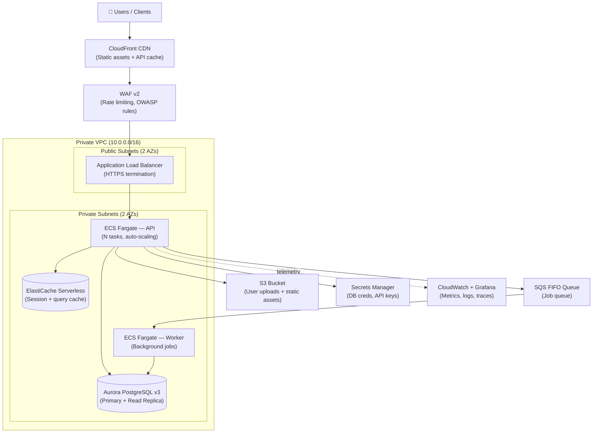

# Infrastructure Design

Scan the codebase, ask targeted questions, then produce a professional HLD with diagram and cost estimate.

---

## Compatibility
- Required tools: Read, Grep, Glob, Bash, WebSearch, WebFetch
- Required access: codebase root (or app description if no code is available)
- Output: HLD document with Mermaid diagram + cost table + trade-off matrix

---

## Workflow

### Step 1 — Codebase Scan

Read the codebase to detect infrastructure signals. Check these patterns in order:

| Signal | What to look for |
|--------|-----------------|
| **App type** | HTTP routes → API/Web; `celery`, `rq`, `bull` → background workers; `socket.io`, `websockets` → realtime; ML model files / `torch`, `transformers` → ML serving |
| **Framework** | `FastAPI`, `Django`, `Express`, `NestJS`, `Next.js`, `Rails`, `Spring Boot`, `Go net/http` |
| **Database** | `psycopg2`, `asyncpg`, `pg`, `sequelize` → PostgreSQL; `pymongo`, `mongoose` → MongoDB; `redis`, `ioredis` → Redis; `sqlite3` → SQLite |
| **File storage** | `boto3`, `s3`, `@aws-sdk/s3`, `multer`, `blob` → object storage needed |
| **Auth** | `jwt`, `passport`, `nextauth`, `supertokens`, `firebase/auth` → auth service signal |
| **Queue / jobs** | `celery`, `arq`, `bull`, `inngest`, `sidekiq` → async worker needed |
| **Containers** | `Dockerfile`, `docker-compose.yml` present → container deployment expected |
| **Existing infra hints** | `.env.example` keys, any `terraform/`, `k8s/`, `infra/` directory |
| **Traffic signals** | README mentions MAU/RPS, load tests, or SLAs |

Summarize findings as:
```
App: [type] | Framework: [name] | DB: [type] | Cache: [yes/no] | Storage: [yes/no]
Workers: [yes/no] | Auth: [yes/no] | Realtime: [yes/no] | Containers: [yes/no]
```

### Step 2 — Clarifying Questions

Ask all of these in one message. Do not proceed until the user answers at least Q1–Q4:

| # | Question | Why it matters |
|---|----------|---------------|
| Q1 | Expected traffic: requests/day or MAU? | Determines compute tier and DB size |
| Q2 | Monthly budget ceiling? ($50 / $500 / $5k / uncapped) | Gates service selection |
| Q3 | Preferred cloud provider? (AWS / GCP / Azure / no preference) | Narrows service catalog |
| Q4 | Team DevOps maturity? (no DevOps / some K8s experience / dedicated SRE team) | Determines managed vs self-managed |
| Q5 | Compliance requirements? (HIPAA / SOC2 / GDPR / none) | Adds encryption, audit logging, region constraints |
| Q6 | Availability requirement? (99.9% / 99.95% / 99.99%) | Determines multi-AZ, read replicas, failover strategy |

If the user says "just show me defaults", use: 10k req/day, $200/mo budget, AWS, no dedicated DevOps, no compliance, 99.9% uptime.

### Step 3 — Select Cloud Services

Map each detected component to the best current service for the user's cloud and budget. Use the catalog below. Run a WebSearch for pricing if uncertain — prices update quarterly.

#### AWS Service Catalog (2025)

| Component | Default Choice | Budget Choice | High-Scale Choice |
|-----------|---------------|--------------|------------------|
| Web/API compute | ECS Fargate | Lambda + API Gateway | EKS with Karpenter |
| Simple container deploy | App Runner | Lambda container | ECS Fargate |
| Background workers | ECS Fargate (separate service) | Lambda (event-driven) | ECS Fargate + SQS |
| PostgreSQL | RDS Aurora PostgreSQL v3 | RDS PostgreSQL t4g.micro | Aurora Serverless v2 |
| MySQL | RDS Aurora MySQL v3 | RDS MySQL t4g.micro | Aurora Serverless v2 |
| Redis cache | ElastiCache Serverless | ElastiCache t4g.micro | ElastiCache Serverless |
| Object storage | S3 + CloudFront | S3 (no CDN) | S3 + CloudFront + Lambda@Edge |
| CDN | CloudFront | CloudFront free tier | CloudFront with WAF |
| Queue | SQS (Standard or FIFO) | SQS Standard | MSK Serverless (Kafka) |
| Load balancer | ALB | ALB | ALB + NLB |
| DNS | Route53 | Route53 | Route53 + health checks |
| Secrets | Secrets Manager | SSM Parameter Store | Secrets Manager with rotation |
| Container registry | ECR | ECR | ECR + lifecycle policies |
| Observability | CloudWatch + Managed Grafana | CloudWatch | CloudWatch + X-Ray + ADOT |
| CI/CD | CodePipeline + CodeBuild | GitHub Actions | GitHub Actions + CodeDeploy |
| Auth (managed) | Cognito | Cognito (free tier 50k MAU) | Cognito + Lambda triggers |
| Realtime / WebSocket | API Gateway WebSocket | API Gateway WebSocket | AppSync + EventBridge |
| ML inference | SageMaker Endpoints | Lambda + EFS (small models) | SageMaker Realtime + Auto Scaling |

#### GCP Service Catalog (2025)

| Component | Default Choice | Budget Choice | High-Scale Choice |
|-----------|---------------|--------------|------------------|
| Web/API compute | Cloud Run v2 | Cloud Run (min instances 0) | GKE Autopilot |
| PostgreSQL | Cloud SQL PostgreSQL 16 | Cloud SQL f1-micro | AlloyDB |
| Redis cache | Memorystore for Redis | Memorystore Basic | Memorystore Cluster |
| Object storage | Cloud Storage + Cloud CDN | Cloud Storage | Cloud Storage + Media CDN |
| Queue | Pub/Sub | Cloud Tasks | Pub/Sub with ordering |
| Observability | Cloud Monitoring + Cloud Trace | Cloud Monitoring | Cloud Monitoring + OpenTelemetry |

#### Azure Service Catalog (2025)

| Component | Default Choice | Budget Choice | High-Scale Choice |
|-----------|---------------|--------------|------------------|
| Web/API compute | Azure Container Apps | Azure Functions | AKS |
| PostgreSQL | Azure DB for PostgreSQL Flexible | Azure DB for PostgreSQL Burstable | Hyperscale (Citus) |
| Redis cache | Azure Cache for Redis | Azure Cache Basic | Azure Cache Enterprise |
| Object storage | Blob Storage + Azure Front Door | Blob Storage | Blob Storage + AFD Premium |
| Queue | Azure Service Bus | Azure Storage Queue | Azure Event Hubs |

### Step 4 — Cost Estimation

Build a monthly cost table. Use these reference rates for AWS us-east-1 (verify with WebSearch):

| Service | Unit Rate (approx) |
|---------|-------------------|
| ECS Fargate | $0.04048/vCPU-hr + $0.004445/GB-hr |
| App Runner | $0.064/vCPU-hr + $0.007/GB-hr |
| RDS Aurora PostgreSQL (db.t4g.medium) | ~$0.068/hr + $0.10/GB-mo storage |
| Aurora Serverless v2 | $0.12/ACU-hr (min 0.5 ACU) |
| ElastiCache Serverless | $0.00034/ECPU + $0.125/GB-hr |
| S3 | $0.023/GB-mo + $0.0004/1k GET |
| CloudFront | $0.0085/10k HTTPS requests + $0.009/GB transfer |
| ALB | $0.018/hr + $0.008/LCU-hr |
| SQS | $0.40/million requests (after 1M free) |
| Route53 | $0.50/hosted zone/mo |
| Secrets Manager | $0.40/secret/mo |
| ECR | $0.10/GB-mo |

Produce the table in this format:

```
| Component | Service | Config | Est. Monthly Cost |
|-----------|---------|--------|------------------|
| API compute | ECS Fargate | 2 tasks × 0.5 vCPU × 1 GB, 730 hrs | $XX |
| Database | Aurora PostgreSQL | db.t4g.medium, 20GB storage | $XX |
| Cache | ElastiCache Serverless | 1 GB data, ~50M ECPU/mo | $XX |
| CDN + Storage | S3 + CloudFront | 50 GB storage, 1M req/mo | $XX |
| Load balancer | ALB | 730 hrs, 2 LCU avg | $XX |
| DNS | Route53 | 1 hosted zone | $XX |
| Secrets | Secrets Manager | 5 secrets | $XX |
| **Total** | | | **$XX/mo** |
```

Add a scaling note: "At 10× traffic, cost scales to approximately $XX/mo — driven primarily by [compute/DB]."

### Step 5 — Generate HLD Document

Produce the complete HLD in this structure:

```
## HLD: [App Name] — [Cloud Provider] Architecture

### System Overview
[2-sentence description of what the system does and its main traffic patterns]

### Architecture Diagram
[Mermaid graph TB diagram — see template below]

### Component Table
[Service selection table from Step 3]

### Cost Estimate
[Table from Step 4]

### Trade-off Matrix
[Table comparing 2-3 architecture options]

### Security Architecture
[Layer-by-layer security table]

### Scaling Strategy
[Traffic tier table]

### Deployment Strategy
[CI/CD pipeline and release approach]

### Failure Mode Analysis
[SPOF table with mitigations]
```

#### Mermaid Diagram Template

Adapt this template to the detected components:



Remove unused components (e.g., drop Worker + SQS if no background jobs detected).

#### Security Architecture Table

```
| Layer | Control | Service |
|-------|---------|---------|
| Edge | DDoS protection, IP allow/block | WAF v2 + Shield Standard |
| Transport | TLS 1.3 termination at ALB | ACM certificate |
| Auth | JWT validation middleware | App layer |
| Secrets | No plaintext secrets in env vars | Secrets Manager |
| Network | All services in private subnets; no public IPs on DB/cache | VPC Security Groups |
| Data at rest | Encryption enabled on RDS, S3, ElastiCache | AWS-managed keys (KMS) |
| Audit | CloudTrail enabled for all API calls | CloudTrail + S3 archive |
```

#### Scaling Strategy Table

```
| Traffic Tier | RPS | Compute Config | DB Config | Est. Cost |
|-------------|-----|---------------|-----------|-----------|
| Seed / MVP | < 10 RPS | 1 task, 0.25 vCPU / 0.5 GB | t4g.micro | ~$40/mo |
| Early growth | 10–100 RPS | 2–4 tasks, 0.5 vCPU / 1 GB | t4g.medium | ~$150/mo |
| Scale | 100–1000 RPS | 4–20 tasks (auto-scale), 1 vCPU / 2 GB | r6g.large + read replica | ~$600/mo |
| High traffic | 1000+ RPS | 20+ tasks, 2 vCPU / 4 GB | Aurora Serverless v2 | ~$2000+/mo |
```

#### Trade-off Matrix

```
| Option | Ops Complexity | Cost at 100 RPS | Cold Start | Verdict |
|--------|--------------|----------------|------------|---------|
| ECS Fargate | Low — no node management | ~$150/mo | None | ✅ Recommended default |
| Lambda + API GW | Very low | ~$30/mo | 200–500ms | ✅ If traffic is spiky / low baseline |
| EC2 Auto Scaling | Medium | ~$100/mo | None | ✅ If team has EC2 experience |
| EKS | High | ~$300/mo (control plane $72) | None | Only if K8s expertise exists |
```

---

## Output Format

```
## HLD: {App Name} — {Cloud} Architecture

### System Overview
{2 sentences}

### Architecture Diagram
```mermaid
{diagram}
```

### Component Table
| Component | Service | Tier | Reason |
...

### Cost Estimate
| Component | Service | Config | Est. Monthly |
...
**Total: ~$XX/mo** | Scales to ~$XX/mo at 10× traffic

### Trade-off Matrix
| Option | Ops Complexity | Cost | Cold Start | Verdict |
...

### Security Architecture
| Layer | Control | Service |
...

### Scaling Strategy
| Traffic Tier | RPS | Compute | DB | Est. Cost |
...

### Deployment Strategy
- Container registry: ECR
- CI: GitHub Actions → build + push image → run tests
- CD: GitHub Actions → ECS rolling deploy (max 200%, min 100% healthy)
- Rollback: ECS `update-service --force-new-deployment` with previous task definition

### Failure Mode Analysis
| Component | SPOF Risk | Mitigation |
| ALB | Low — AWS-managed HA | Multi-AZ by default |
| ECS tasks | Medium — single task fails | min 2 tasks, health check grace period |
| Aurora | Low — multi-AZ standby | Automatic failover < 30s |
| ElastiCache | Medium | App-level fallback to DB if cache miss |
```

---

## Anti-Patterns
- Never finalize a design before asking Q1–Q4 — traffic and budget determine everything.
- Never recommend a service tier without its monthly cost estimate.
- Never produce a diagram with more than 12 nodes — abstract shared services into groups.
- Never omit the trade-off matrix — the user must understand why ECS Fargate over EKS.
- Never use placeholder cost estimates — run a WebSearch for current pricing if unsure.
- Never size for peak traffic without stating it — document the assumption.

---

## Examples

**Input:** "Design infra for my FastAPI app. It uses PostgreSQL, Redis, S3 uploads, and Celery workers."
**Clarifying answers given:** 50k req/day, $300/mo budget, AWS preferred, 2-person team (some Docker), no compliance, 99.9% SLA.

**Step 1 scan output:**
```
App: API | Framework: FastAPI | DB: PostgreSQL | Cache: Redis | Storage: S3
Workers: Celery | Auth: JWT (app layer) | Realtime: no | Containers: yes
```

**Step 3 selection:**
- Compute: ECS Fargate (fits budget, no K8s ops burden)
- DB: RDS Aurora PostgreSQL v3 (db.t4g.medium, 20GB)
- Cache: ElastiCache Serverless (1GB data tier)
- Storage: S3 + CloudFront
- Worker: ECS Fargate (separate service, driven by SQS)
- CI/CD: GitHub Actions → ECR → ECS rolling deploy

**Step 4 cost:**
| Component | Config | Cost |
|-----------|--------|------|
| ECS Fargate (API, 2 tasks) | 0.5 vCPU / 1GB, 730 hrs | $42 |
| ECS Fargate (Worker, 1 task) | 0.25 vCPU / 0.5GB | $11 |
| Aurora PostgreSQL | db.t4g.medium, 20GB | $68 |
| ElastiCache Serverless | 1GB, ~20M ECPU | $18 |
| ALB | 730 hrs, 1 LCU | $20 |
| S3 + CloudFront | 50GB, 500k req | $5 |
| SQS | 5M messages/mo | $2 |
| Secrets Manager + Route53 | 5 secrets, 1 zone | $3 |
| **Total** | | **~$169/mo** |

Scales to ~$450/mo at 10× traffic (driven by Aurora + Fargate).

---

## Infrastructure Design Specialization

**For ML / model-serving apps:**
- Add SageMaker Realtime Endpoint (p3.2xlarge ~$3.06/hr) or Lambda container (for models < 500MB)
- Separate inference traffic behind a second ALB target group
- Add EFS mount for model weights if > 512MB
- Cost warning: GPU instances dominate the bill — estimate `hours × instance_rate × replication`

**For Next.js / SSR apps:**
- Recommend CloudFront + S3 for static assets; API routes behind ECS Fargate or Lambda
- Consider App Runner for zero-config container deploy if team has no ECS experience
- Vercel is a valid free-alternative — note it in the trade-off matrix

**For compliance workloads (HIPAA / SOC2):**
- Add: VPC Flow Logs, CloudTrail to S3, AWS Config rules, GuardDuty, Security Hub
- Require: RDS encryption at rest (KMS CMK), S3 SSE-KMS, TLS 1.2 minimum
- Cost addition: ~$30-60/mo for GuardDuty + Config + Security Hub

**For realtime / WebSocket apps:**
- AWS: API Gateway WebSocket API (no Fargate needed for connection management)
- GCP: Cloud Run with HTTP/2 streaming
- Always separate WebSocket connections from HTTP API to allow independent scaling
