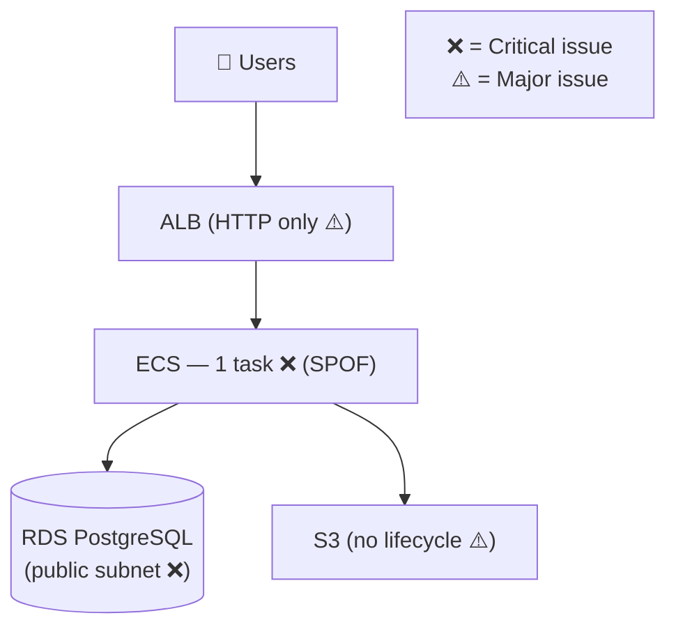
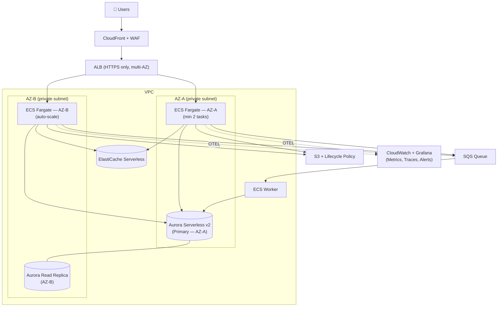

# Infrastructure Evaluation

Read existing infra files, diagnose issues, and produce a dual-timeline improvement plan.

---

## Compatibility
- Required tools: Read, Grep, Glob, Bash, WebSearch
- Required inputs: At least one of — Terraform/CDK/Pulumi files, K8s manifests, docker-compose.yml, serverless.yml, CI/CD configs, cloud provider config files
- Output: Professional audit report with two Mermaid diagrams (current + target state) and dual-timeline action plan

---

## Workflow

### Step 1 — Discover Infra Files

Search the repo for all infrastructure artifacts:

```bash
find . -name "*.tf" -o -name "*.tfvars" -o -name "cdk.json" \
  -o -name "docker-compose*.yml" -o -name "serverless.yml" \
  -o -name "*.yaml" -path "*/k8s/*" -o -name "Pulumi.yaml" \
  -o -name ".github/workflows/*.yml" -o -name "Dockerfile*" \
  | head -60
```

Also check: `infra/`, `terraform/`, `k8s/`, `deploy/`, `.github/`, `helm/` directories.

For each file found, read it and extract:
- Cloud provider and region
- Compute resources (EC2, ECS, Lambda, containers, K8s deployments)
- Database resources (RDS, DynamoDB, Cloud SQL, managed DB configs)
- Network topology (VPCs, subnets, security groups, load balancers)
- Storage (S3 buckets, EBS volumes, EFS, PVCs)
- IAM / permissions (roles, policies, service accounts)
- Observability (CloudWatch, Datadog, Prometheus, alerts)
- CI/CD pipeline (build, test, deploy steps)

### Step 2 — Analyze Against Evaluation Framework

Score each domain against the framework below. Mark each item: ✅ Present | ⚠️ Partial | ❌ Missing

#### Reliability
| Check | Signal to look for |
|-------|------------------|
| Multi-AZ / multi-zone deployment | `availability_zones`, replica count > 1, K8s `podAntiAffinity` |
| Database read replicas or standby | `multi_az = true`, `replica_count`, Aurora global tables |
| Health checks configured | ALB target group health checks, K8s `livenessProbe` + `readinessProbe` |
| Graceful shutdown handling | `preStop` hook in K8s, ECS `stopTimeout`, drain period |
| Auto-scaling configured | ASG, ECS service auto-scaling, HPA/KEDA in K8s |

#### Security
| Check | Signal to look for |
|-------|------------------|
| No hardcoded secrets | Scan for `password =`, `secret =`, `api_key =` literal strings in TF/YAML |
| Least-privilege IAM | Wildcard `*` actions or resources in IAM policies |
| Encryption at rest | `storage_encrypted = true` on RDS, S3 bucket encryption, K8s secrets encrypted |
| Encryption in transit | `require_ssl` on RDS, no HTTP listeners on ALB |
| Network segmentation | DB and cache in private subnets, no 0.0.0.0/0 ingress on DB ports |
| WAF / DDoS protection | WAF association on ALB/CloudFront, Shield or Cloud Armor |

#### Cost Efficiency
| Check | Signal to look for |
|-------|------------------|
| Right-sized instances | Overprovisioned instances (r5.4xlarge for small workloads) |
| Unused resources | Unattached EBS volumes, idle Elastic IPs, stopped EC2 with attached storage |
| Reserved / Savings Plans | On-Demand for baseline load = overpaying by 30–40% |
| Auto-scaling ceiling set | No `max_capacity` on auto-scaling = runaway cost risk |
| S3 lifecycle policies | No lifecycle rules on large S3 buckets = indefinite storage growth |
| NAT Gateway traffic | High NAT Gateway costs = data flowing through NAT unnecessarily |

#### Observability
| Check | Signal to look for |
|-------|------------------|
| Structured logging | `LOG_FORMAT=json` or equivalent |
| Metrics exported | CloudWatch agent, Prometheus scrape config, or Datadog agent |
| Distributed tracing | X-Ray, Jaeger, Tempo, or OTEL collector configured |
| Alerting rules | CloudWatch Alarms, PagerDuty wiring, or Alertmanager rules |
| Dashboard defined | Grafana dashboard files, CloudWatch dashboard JSON |
| Log retention policy | CloudWatch log group retention < ∞, S3 lifecycle on log buckets |

#### Scalability
| Check | Signal to look for |
|-------|------------------|
| Stateless compute | No persistent local disk on API containers |
| DB connection pooling | PgBouncer, RDS Proxy, or Prisma pool config |
| Cache layer present | Redis/Memcached in front of DB reads |
| CDN for static assets | CloudFront/Cloud CDN distribution for S3/GCS |
| Queue for async work | SQS/Pub/Sub/RabbitMQ decoupling sync endpoints from slow work |

#### Operational
| Check | Signal to look for |
|-------|------------------|
| IaC for all resources | Manually created resources not in any IaC → drift risk |
| IaC state remote | Terraform remote state (S3 + DynamoDB lock), not local |
| Runbook or README | `/docs`, `/runbooks`, or inline comments on complex resources |
| Backup policy | RDS automated backups enabled, backup retention > 7 days |
| Disaster recovery plan | Cross-region snapshot copy, RTO/RPO defined anywhere |

### Step 3 — Classify Issues

For every failed check from Step 2, classify severity:

| Severity | Definition | Response time |
|----------|-----------|--------------|
| **Critical** | Causes data loss, outage, or security breach if triggered | Fix within 24 hours |
| **Major** | Causes degraded availability or significant cost waste | Fix within 2 weeks |
| **Minor** | Operational improvement, no immediate risk | Address in next sprint |

Build the issues table:

```
| # | Severity | Domain | Issue | Evidence | Risk if unaddressed |
|---|----------|--------|-------|----------|-------------------|
| 1 | Critical | Security | RDS accessible from 0.0.0.0/0 on port 5432 | sg-xxx ingress rule | Any public IP can attempt auth brute-force |
| 2 | Critical | Reliability | Single ECS task, no min capacity set | service min_count = 1 | One task failure = full outage |
| 3 | Major | Cost | db.r5.2xlarge running at 8% CPU avg | CloudWatch CPUUtilization | $800/mo overspend vs db.t4g.large |
...
```

### Step 4 — Draw Current State Diagram

Produce a Mermaid diagram representing what exists now, including problem areas annotated:



### Step 5 — Short-Term Plan (0–30 Days)

Quick wins: high-impact, low-effort changes. Each item must be independently deployable without downtime.

Format:
```
| Priority | Action | Effort | Risk | Impact | Owner |
|----------|--------|--------|------|--------|-------|
| P0 | Restrict RDS security group to ECS SG only | 30 min | None — no app change | Eliminates public DB exposure | DevOps |
| P0 | Set ECS service min_count = 2 | 15 min | None | Eliminates SPOF | DevOps |
| P1 | Enable RDS automated backups (7-day retention) | 10 min | None | Enables point-in-time recovery | DevOps |
| P1 | Add ALB HTTPS listener + ACM cert | 1 hr | None if done before HTTP removal | Encrypts all user traffic | DevOps |
| P2 | Downsize RDS to db.t4g.large | 20 min + maintenance window | Minor — instance restart | Save ~$300/mo | DevOps |
```

Rules for short-term items:
- Max effort per item: 4 hours
- No app code changes required
- No schema migrations
- Each item must have an explicit verification step

### Step 6 — Long-Term Plan (3–12 Months)

Strategic improvements that require planning, testing, and potentially app changes:

```
| Quarter | Initiative | Effort | Expected Outcome |
|---------|-----------|--------|-----------------|
| Q1 | Migrate to Aurora Serverless v2 (removes idle DB cost, scales to 0) | 2 weeks | ~40% DB cost reduction at low traffic |
| Q1 | Add PgBouncer / RDS Proxy for connection pooling | 1 week | Support 10× concurrent connections without DB overload |
| Q2 | Implement multi-AZ deployment across 2 availability zones | 3 weeks | 99.95% uptime SLA achievable |
| Q2 | Add CloudFront + WAF in front of ALB | 1 week | DDoS protection, 50ms latency improvement for global users |
| Q2 | Implement structured logging + OpenTelemetry tracing | 2 weeks | Full observability stack, distributed trace on every request |
| Q3 | Move Terraform state to S3 + DynamoDB lock (if local) | 1 day | Enables team collaboration, eliminates state corruption risk |
| Q3 | Set up Reserved Instances or Savings Plans for baseline load | 1 day | 30–40% cost reduction on steady-state compute and DB |
| Q4 | Implement blue/green deployment (ECS CodeDeploy) | 2 weeks | Zero-downtime deploys, instant rollback |
| Q4 | Cross-region DR: automated RDS snapshot copy to secondary region | 1 week | RPO < 24hr, RTO < 2hr for regional failure |
```

### Step 7 — Draw Target State Diagram

Produce a Mermaid diagram of the desired end state after long-term plan is complete:



---

## Output Format

```
## Infrastructure Audit: {Project Name}

### Audit Summary
Evaluated on: {date}
Files reviewed: {list}
Issues found: {N} Critical, {N} Major, {N} Minor
Overall health: 🔴 Needs urgent attention / 🟡 Stable with risks / 🟢 Production-ready

### Current State
```mermaid
{current state diagram — annotated with ❌ and ⚠️}
```

### Issues Table
| # | Severity | Domain | Issue | Evidence | Risk |
...

### Short-Term Plan (0–30 Days)
| Priority | Action | Effort | Risk | Impact |
...

### Long-Term Plan (3–12 Months)
| Quarter | Initiative | Effort | Expected Outcome |
...

### Target State
```mermaid
{target state diagram}
```

### Quick-Win Commands
[Copy-paste commands to fix P0 items immediately]
```

---

## Anti-Patterns
- Never produce recommendations without reading the actual infra files — assumptions produce wrong advice.
- Never classify an issue as Critical unless it directly causes outage, data loss, or security breach.
- Never put a long-term item in the short-term plan — if it requires app code changes, it's long-term.
- Never recommend a service upgrade without verifying the current service's actual utilization metrics.
- Never skip drawing both diagrams — the before/after comparison is the most valuable part of the report.
- Never list more than 10 short-term items — prioritization means cutting, not listing everything.

---

## Examples

**Input:** User shares a `docker-compose.yml` with PostgreSQL + a FastAPI app + Nginx, and a `main.tf` that creates an EC2 t3.large, RDS t3.large (public), and S3 bucket.

**Step 2 findings:**
- Reliability: ❌ single EC2 instance, no ASG; ❌ no DB replica
- Security: ❌ RDS security group allows 0.0.0.0/0:5432; ⚠️ no WAF; ✅ S3 private
- Cost: ⚠️ t3.large likely oversized; ⚠️ no Savings Plan
- Observability: ❌ no CloudWatch agent; ❌ no alarms
- Scalability: ⚠️ no cache layer; ⚠️ no CDN

**Step 5 short-term (top 3):**
1. P0 — Restrict RDS SG to EC2 SG only (30 min, eliminates public DB access)
2. P0 — Enable RDS automated backups with 7-day retention (10 min)
3. P1 — Add ALB + HTTPS listener, move EC2 off public IP (1 hr)

**Step 6 long-term:**
- Q1: Move to ECS Fargate with 2 tasks across 2 AZs (eliminate EC2 SPOF)
- Q2: Add Aurora Serverless v2, enable multi-AZ, downsize from t3.large
- Q3: Add CloudWatch alarms + Grafana dashboard + structured logging

---

## Evaluation Specialization

**For Kubernetes clusters:**
- Check: `PodDisruptionBudget` defined, `ResourceRequests/Limits` on all containers, `NetworkPolicy` present, RBAC roles not using `cluster-admin`
- Check: Node group auto-scaling enabled, spot instances in non-critical node groups, cluster version within N-1 of latest

**For serverless (Lambda / Cloud Run):**
- Check: timeout set appropriately (not default 3s for DB-heavy functions), reserved concurrency or max instances set (prevents runaway scaling cost), VPC config if DB access needed (adds cold start — document the trade-off)

**For cost-focused audits:**
- Run AWS Cost Explorer `aws ce get-cost-and-usage` or GCP Billing Export query to get actual spend breakdown before recommending changes — never guess which service is the cost driver
