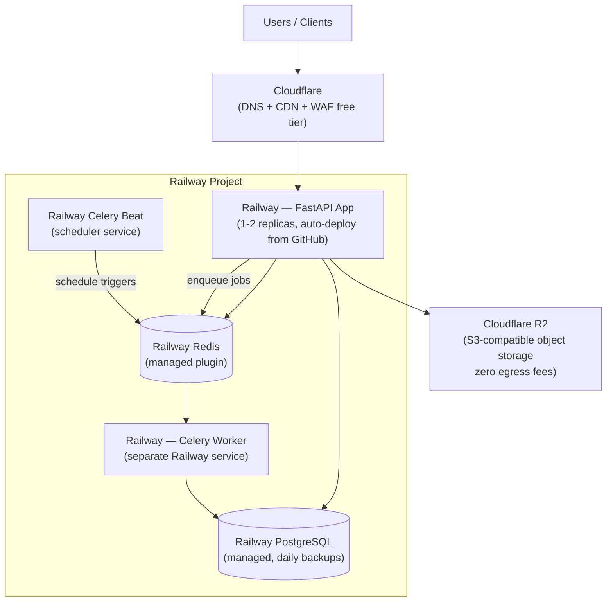
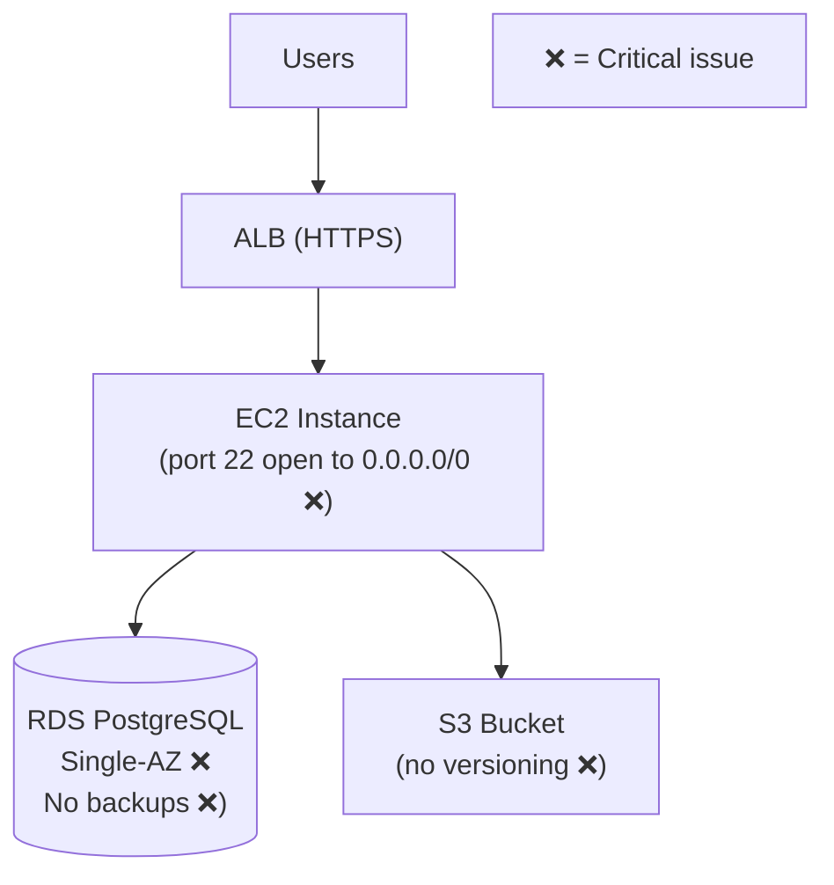
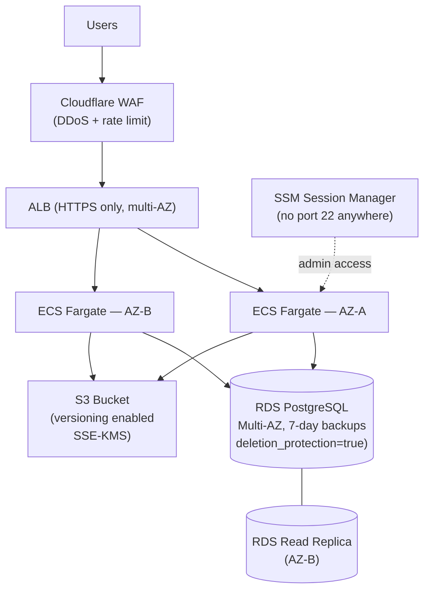

# Production Infrastructure Scenarios

Real end-to-end worked examples. Use these as reference outputs when calibrating the quality and format of your own infrastructure planning work.

---

## Scenario 1: Startup FastAPI App (0 to Production)

### Context

| Attribute | Value |
|-----------|-------|
| Stack | FastAPI + PostgreSQL + Redis + Celery + S3 |
| Team | 3 developers, startup, no dedicated DevOps |
| Budget ceiling | $100/mo |
| Traffic | ~5k–50k req/day at launch, hoping to reach 100k+ |
| Availability | 99.9% (allowing ~8 hrs/year downtime) |
| Compliance | None |
| Cloud preference | No preference — optimize for cost and simplicity |

### Step 1 — Codebase Scan Summary

```
App: API + async workers | Framework: FastAPI | DB: PostgreSQL
Cache: Redis | Storage: S3 uploads | Workers: Celery
Auth: JWT (app layer) | Realtime: no | Containers: yes (Dockerfile present)
```

### Architecture Decision: Railway over ECS

The team evaluated two primary options:

| Factor | Railway | AWS ECS Fargate |
|--------|---------|----------------|
| Monthly cost at launch | ~$40–60/mo | ~$200–300/mo |
| Setup time | 30 min | 2–4 days (VPC, ECR, ALB, ECS service, IAM, RDS) |
| Managed Postgres | Yes (built-in, one-click) | RDS — separate service, separate billing |
| Managed Redis | Yes (built-in plugin) | ElastiCache — separate service, ~$15–40/mo |
| CI/CD | Auto-deploy from GitHub (zero config) | GitHub Actions → ECR → ECS (must configure) |
| TLS / custom domain | Automatic Let's Encrypt | ACM + ALB (must configure) |
| Ops overhead | Near zero | Medium (team must manage VPC, SGs, IAM, ECS) |
| DevOps maturity required | None | Some (Docker + AWS CLI literacy) |
| Migration path | Straightforward — same Docker containers | N/A |
| Verdict | **Use for 0–100k req/day** | Migrate to this when Railway limits are hit |

**Decision: Railway** — the 3-person team avoids the AWS complexity tax at this stage. The entire stack (app, Postgres, Redis, S3-compatible storage) runs on Railway for ~$40–60/mo vs ~$200–300/mo on AWS with a fraction of the setup effort.

**When to migrate to AWS ECS:** At sustained >100k requests/day, when Railway's vertical scaling limits are hit, when multi-region is needed, or when compliance requirements demand VPC isolation.

### Architecture Diagram



### Component Table

| Component | Service | Reason |
|-----------|---------|--------|
| API compute | Railway (Docker container) | Auto-deploy, no VPC/ALB setup, scales vertically |
| Background workers | Railway (separate service, same repo) | Celery connects to same Redis; independent scaling |
| Celery Beat scheduler | Railway (third service) | Keeps periodic tasks separate from worker pool |
| PostgreSQL | Railway Postgres plugin | One-click, daily backups included, same project network |
| Redis / cache / broker | Railway Redis plugin | Celery broker + cache in one, no separate ElastiCache billing |
| Object storage | Cloudflare R2 | S3-compatible API, zero egress cost, 10GB free |
| CDN + DDoS protection | Cloudflare free tier | Free WAF + DDoS + CDN in front of Railway domain |
| Secrets management | Railway environment variables | Sufficient at this stage; migrate to Vault/Infisical at scale |
| CI/CD | GitHub → Railway auto-deploy | Zero config; Railway detects push and redeploys |

### Cost Estimate

| Component | Service | Config | Est. Monthly |
|-----------|---------|--------|-------------|
| API service | Railway | ~2 vCPU / 2 GB RAM avg | $15–20 |
| Celery Worker | Railway | ~1 vCPU / 1 GB RAM | $8–12 |
| Celery Beat | Railway | ~0.1 vCPU / 256 MB RAM | $2–3 |
| PostgreSQL | Railway Postgres | 1 GB RAM, 5 GB disk | $10–15 |
| Redis | Railway Redis | 256 MB RAM | $3–5 |
| Object Storage | Cloudflare R2 | 10 GB (free tier) | $0 |
| CDN + WAF | Cloudflare | Free tier | $0 |
| Domain + TLS | Railway + Cloudflare | Included | $0 |
| **Total** | | | **~$38–55/mo** |

AWS ECS equivalent (RDS t4g.medium + ElastiCache t4g.micro + ECS Fargate 2 tasks + ALB + ECR + Route53) would run **~$200–280/mo** for the same stack.

**Scaling note:** At 10× traffic (~500k req/day), costs scale to ~$120–180/mo on Railway. At that point, ECS Fargate at ~$350–450/mo becomes competitive when factoring Railway's per-replica pricing ceiling.

### When to Migrate Off Railway

| Trigger | Migration target |
|---------|----------------|
| Sustained >100k req/day, hitting Railway memory/CPU limits | AWS ECS Fargate + Aurora PostgreSQL |
| Need VPC isolation for compliance (HIPAA / SOC2) | AWS ECS + RDS in private subnets |
| Need multi-region deployment | AWS (multi-region ECS) or Fly.io (edge-native) |
| PostgreSQL >20 GB and needing read replicas | RDS Aurora PostgreSQL |
| Team grows to 8+ with dedicated DevOps | EKS or ECS Fargate with full IaC |

### Trade-off Matrix

| Option | Ops Complexity | Cost at 50k req/day | Migration Effort | Verdict |
|--------|---------------|---------------------|-----------------|---------|
| Railway | Very low | ~$50/mo | N/A | **Recommended for 0–100k req/day** |
| Render | Very low | ~$50/mo | Minimal | Viable; Railway has better Celery support |
| Fly.io | Low | ~$40/mo | Low (Dockerfile-native) | Good if global edge matters now |
| AWS ECS + RDS | Medium | ~$250/mo | High (weeks of setup) | Over-engineered for 3-person startup |
| Heroku | Very low | ~$100/mo | Low | More expensive; Railway has better DX |

---

## Scenario 2: Terraform Audit — Critical Issues Found

### Context

| Attribute | Value |
|-----------|-------|
| Project | Production web app on AWS |
| IaC | Terraform (HCL files in `terraform/` directory) |
| Request | "Can you audit my Terraform? I want to make sure it's production-ready." |

### Files Reviewed

- `terraform/main.tf`
- `terraform/rds.tf`
- `terraform/s3.tf`
- `terraform/security_groups.tf`
- `terraform/variables.tf`

### Issues Found During Audit

The simulated Terraform config contained the following problems, each with evidence and risk:

#### Issue 1 — S3 Bucket Without Versioning (Critical — Data Loss Risk)

**Evidence in `terraform/s3.tf`:**
```hcl
resource "aws_s3_bucket" "uploads" {
  bucket = "myapp-user-uploads"
  # No versioning block present
}
```

**Risk:** Any accidental `DELETE` or overwrite is permanent and unrecoverable. A single bug in application code, a bad deploy, or a misconfigured lifecycle rule can permanently destroy user data with no rollback path.

**Fix:**
```hcl
resource "aws_s3_bucket_versioning" "uploads" {
  bucket = aws_s3_bucket.uploads.id
  versioning_configuration {
    status = "Enabled"
  }
}
```

**Effort:** 5 minutes. Apply with `terraform apply`. No downtime.

---

#### Issue 2 — Security Group with 0.0.0.0/0 on Port 22 (Critical — Security Risk)

**Evidence in `terraform/security_groups.tf`:**
```hcl
resource "aws_security_group_rule" "ssh_ingress" {
  type        = "ingress"
  from_port   = 22
  to_port     = 22
  protocol    = "tcp"
  cidr_blocks = ["0.0.0.0/0"]  # ← any IP on the internet can attempt SSH
  security_group_id = aws_security_group.ec2.id
}
```

**Risk:** Any IP on the internet can attempt SSH authentication. Automated bots scan port 22 continuously. If a weak key or password auth is enabled (or a future misconfiguration enables it), this is a trivial remote code execution vector.

**Fix — Option A (restrict to office IP):**
```hcl
resource "aws_security_group_rule" "ssh_ingress" {
  type        = "ingress"
  from_port   = 22
  to_port     = 22
  protocol    = "tcp"
  cidr_blocks = ["YOUR_OFFICE_IP/32"]
  security_group_id = aws_security_group.ec2.id
}
```

**Fix — Option B (preferred — use SSM Session Manager, remove SSH entirely):**
```hcl
# Remove the ssh_ingress rule entirely.
# Add IAM role with AmazonSSMManagedInstanceCore policy to the EC2 instance.
# Access via: aws ssm start-session --target <instance-id>
```

Option B is strongly preferred. It eliminates port 22 exposure entirely and provides full audit logs of all shell sessions.

**Effort:** Option A — 15 minutes. Option B — 30–60 minutes (IAM role + SSM agent). No downtime for either.

---

#### Issue 3 — RDS with No Automated Backups (Critical — Data Loss Risk)

**Evidence in `terraform/rds.tf`:**
```hcl
resource "aws_db_instance" "primary" {
  identifier        = "myapp-prod"
  instance_class    = "db.t4g.medium"
  engine            = "postgres"
  engine_version    = "15.4"
  backup_retention_period = 0  # ← disables automated backups entirely
  # ...
}
```

**Risk:** `backup_retention_period = 0` disables all automated backups. If the database is corrupted, accidentally dropped, or infected with ransomware, there is no point-in-time recovery. The only option is restore from the last manual snapshot — which may be days or weeks old, or may not exist.

**Fix:**
```hcl
resource "aws_db_instance" "primary" {
  # ...
  backup_retention_period = 7          # 7-day rolling backup window
  backup_window           = "03:00-04:00"  # UTC, low-traffic window
  maintenance_window      = "Mon:04:00-Mon:05:00"
  deletion_protection     = true       # prevent accidental terraform destroy
}
```

**Effort:** 5 minutes. Applying changes `backup_retention_period` from 0 to 7 causes a brief RDS parameter update — no downtime, completes in ~2 minutes.

---

#### Issue 4 — No Multi-AZ for Production Database (Major — Single Point of Failure)

**Evidence in `terraform/rds.tf`:**
```hcl
resource "aws_db_instance" "primary" {
  # ...
  multi_az = false  # ← single AZ only
}
```

**Risk:** If the AWS availability zone hosting the RDS instance has an outage (hardware failure, AZ-level event), the database is unavailable until AWS recovers the underlying infrastructure — typically 15 minutes to 2+ hours. No automatic failover occurs.

**Fix:**
```hcl
resource "aws_db_instance" "primary" {
  # ...
  multi_az = true  # creates standby in second AZ; automatic failover < 60s
}
```

**Cost impact:** Multi-AZ doubles the RDS instance cost (~$68/mo → ~$136/mo for db.t4g.medium). This is the cost of production-grade reliability.

**Effort:** 5 minutes to change the Terraform. RDS will provision the standby during the next maintenance window or immediately (expect 10–20 min of elevated I/O during sync). No downtime.

---

### Full Audit Report

#### Current State Diagram



#### Issues Table

| # | Severity | Domain | Issue | Evidence | Risk if Unaddressed |
|---|----------|--------|-------|----------|-------------------|
| 1 | Critical | Security | SSH port 22 open to 0.0.0.0/0 | `security_groups.tf` cidr 0.0.0.0/0 on port 22 | Any internet host can attempt SSH brute-force / exploit |
| 2 | Critical | Reliability | RDS backup_retention_period = 0 | `rds.tf` explicit 0 value | Zero recovery capability on data loss or corruption |
| 3 | Critical | Reliability | S3 bucket versioning disabled | `s3.tf` no versioning block | Any file delete/overwrite is permanent |
| 4 | Major | Reliability | RDS single-AZ (multi_az = false) | `rds.tf` multi_az = false | AZ-level AWS outage = full DB downtime, no auto-failover |

#### Short-Term Plan (0–30 Days)

| Priority | Action | Effort | Risk | Impact |
|----------|--------|--------|------|--------|
| P0 | Enable S3 versioning on uploads bucket | 5 min | None | All future deletions become recoverable |
| P0 | Restrict port 22 SG rule to your IP; or switch to SSM Session Manager | 15–60 min | None | Eliminates internet-facing SSH exposure |
| P0 | Set `backup_retention_period = 7` on RDS | 5 min | None (< 2 min RDS parameter update) | Enables 7-day point-in-time recovery |
| P1 | Set `deletion_protection = true` on RDS | 5 min | None | Prevents accidental `terraform destroy` of DB |
| P1 | Enable `multi_az = true` on RDS | 5 min Terraform, 20 min AWS provisioning | Brief I/O spike during sync | Automatic failover < 60s on AZ failure |

**Verification steps for each P0:**
- S3 versioning: `aws s3api get-bucket-versioning --bucket myapp-user-uploads` → should return `"Status": "Enabled"`
- SSH rule: `aws ec2 describe-security-groups --group-ids <sg-id>` → no `0.0.0.0/0` ingress on port 22
- RDS backups: `aws rds describe-db-instances --db-instance-identifier myapp-prod | grep BackupRetentionPeriod` → should return 7

#### Long-Term Improvements (3–12 Months)

| Quarter | Initiative | Effort | Expected Outcome |
|---------|-----------|--------|-----------------|
| Q1 | Move all EC2 SSH access to SSM Session Manager; eliminate all port 22 rules | 1 day | Zero network attack surface; full audit log of all shell sessions |
| Q1 | Enable S3 server-side encryption (SSE-S3 or SSE-KMS) | 30 min | Data at rest encrypted; meets most compliance baselines |
| Q2 | Enable CloudTrail + CloudWatch log group alerts for IAM changes | 1 day | Audit trail for all AWS API calls; alert on privilege escalation |
| Q2 | Tag all resources; enable AWS Cost Anomaly Detection | 1 day | Cost spikes detected automatically |
| Q3 | Add S3 lifecycle rule: transition to S3 Glacier IR after 90 days | 30 min | ~60% storage cost reduction on old uploads |
| Q3 | Evaluate Aurora Serverless v2 (scales to 0, lower idle cost) | 2 weeks | Potential 30–50% DB cost reduction at low traffic |

#### Target State Diagram



---

## Scenario 3: Free Alternatives Mapping

### Context

| Attribute | Value |
|-----------|-------|
| User's current stack | Firebase, Heroku, Datadog, Auth0, Twilio |
| Current total spend | ~$165/mo |
| Goal | Reduce cost as much as possible without breaking the app |
| App type | Node.js / Next.js web app with auth, notifications, and monitoring |

### Current Paid Stack

| Category | Current Service | Est. Monthly Cost |
|----------|----------------|------------------|
| Hosting / PaaS | Heroku Standard-1X dynos (2×) | $50/mo |
| Database + Realtime + Storage | Firebase Firestore + Storage | $30/mo |
| Auth | Auth0 Developer | $23/mo |
| Monitoring | Datadog | $15/mo |
| SMS / Voice | Twilio | $20/mo (2k SMS/mo) |
| Miscellaneous | Firebase hosting | $5/mo |
| **Total** | | **~$143/mo** |

### Full Alternatives Map

#### Hosting (Heroku → Alternatives)

| Service | Tier | Monthly Cost | Compatibility | Migration Effort |
|---------|------|-------------|--------------|-----------------|
| **Railway** | Hobby/Pro | ~$5–25/mo | Procfile compatible, Docker support | 2–4 hrs |
| **Render** | Starter | $7–14/mo | Procfile + Docker; add `render.yaml` | 2–4 hrs |
| **Fly.io** | Pay-as-you-go | ~$5–15/mo | Docker-native; `fly.toml` config | 3–6 hrs |
| **Coolify (self-hosted)** | Self-hosted on Hetzner | ~$5–8/mo (server) | Docker; full control | 4–8 hrs setup |

**Recommended:** Railway (best Heroku DX parity) or Render (slightly more stable free tier for static Next.js front-end).

---

#### Database + Backend (Firebase → Alternatives)

| Service | Tier | Monthly Cost | Notes |
|---------|------|-------------|-------|
| **Supabase** | Free / Pro ($25) | $0–25/mo | Postgres + Realtime + Storage + Auth in one — best full Firebase replacement |
| **PocketBase** | Self-hosted | ~$3–5/mo server | Single binary, SQLite, realtime, auth; minimal ops |
| **Appwrite** | Self-hosted / Cloud | $0 self-hosted | Firebase-like API surface; Docker compose deploy |
| **Neon** | Free / Launch ($19) | $0–19/mo | Postgres only (no realtime/auth); best if app is already Postgres-ready |

**Migration effort from Firebase:** Firestore SDK is incompatible — a rewrite of the data access layer is required (estimate 1–3 weeks depending on app size). Auth migration: Firebase Auth users can be exported and imported to Supabase Auth using the Supabase CLI migration tool. Realtime: replace Firebase `onSnapshot` with Supabase `channel().on('postgres_changes', ...)`.

---

#### Auth (Auth0 → Alternatives)

| Service | Tier | Monthly Cost | Notes |
|---------|------|-------------|-------|
| **Supabase Auth** | Free (50k MAU) | $0 / $25 (Pro) | If already using Supabase DB — zero extra cost |
| **Clerk** | Free (10k MAU) | $0 / $25 | Best pre-built UI components for Next.js; drop-in |
| **Auth.js / NextAuth** | Free (self-managed) | $0 | 50+ OAuth providers; minimal setup for Next.js |
| **Keycloak** | Self-hosted | ~$5/mo server | Enterprise SSO, SAML, LDAP — overkill for most |

**Migration effort from Auth0:** JWT verification endpoint changes (update JWKS URL). User data export via Auth0 Management API → import to new provider. Social OAuth credentials (Google, GitHub) are reusable. Estimate: 2–5 days.

---

#### Monitoring (Datadog → Alternatives)

| Service | Tier | Monthly Cost | Notes |
|---------|------|-------------|-------|
| **Grafana Cloud** | Free (10k metrics, 50GB logs, 50GB traces) | $0 | Best full-stack replacement; metrics + logs + traces |
| **Better Stack** | Free (1GB logs, 3-day retention) | $0 / $24 | Simpler; good for small log volumes |
| **Axiom** | Free (500GB ingest, 30-day retention) | $0 / $25 | Excellent for high-volume structured logs |
| **Signoz (self-hosted)** | Self-hosted | ~$5/mo server | OpenTelemetry-native; metrics + logs + traces |

**Migration from Datadog:** Replace Datadog agent with OpenTelemetry Collector → export to Grafana Cloud (free). Dashboard migration: export Datadog dashboards as JSON → import to Grafana (most panel types map 1:1). Estimate: 1–2 days.

---

#### SMS / Notifications (Twilio → Alternatives)

| Service | Tier | Monthly Cost | Notes |
|---------|------|-------------|-------|
| **Telnyx** | Pay-as-you-go | ~$0.005/SMS (vs Twilio ~$0.0079) | 37% cheaper per SMS; same API shape |
| **Plivo** | Pay-as-you-go | ~$0.0055/SMS | Similar savings to Telnyx |
| **Vonage (Nexmo)** | Pay-as-you-go | ~$0.0065/SMS | Good EU coverage |
| **Self-hosted (Termux / SMS gateway)** | Self-hosted | Hardware cost only | Only for tiny dev-tool use cases |
| **Push notifications instead** | Firebase FCM / Expo push | $0 | Replace SMS with push where app is native/PWA |

**Recommended:** For 2k SMS/mo, Telnyx saves ~$5–6/mo. Code migration is trivial (same REST API pattern, different endpoint + credentials). Estimate: 2–4 hrs.

---

### Tier Matrix

| Tier | Stack | Total Cost | Limitations |
|------|-------|-----------|-------------|
| **Completely Free** | Render free + Supabase free + Supabase Auth + Grafana Cloud free + Telnyx PAYG | ~$10/mo (SMS only) | Render spin-down, Supabase pauses after 1 week inactivity, 3-day log retention |
| **Free Tier (no spin-down)** | Railway Hobby + Supabase Pro + Clerk free + Grafana Cloud free + Telnyx PAYG | ~$35–40/mo | Railway usage-based pricing can spike at high traffic |
| **Cheap Self-Hosted** | Coolify on Hetzner + PostgreSQL + Auth.js + Signoz + Telnyx PAYG | ~$18–25/mo | Requires 4–8 hrs setup; ongoing maintenance responsibility |
| **Current (Heroku + Firebase + Auth0 + Datadog + Twilio)** | (baseline) | ~$143/mo | N/A |

### Estimated Savings

| Scenario | Monthly Cost | Annual Savings vs Current |
|----------|-------------|--------------------------|
| Completely free stack | ~$10/mo | ~$1,596/yr |
| Free-tier stack (production-viable) | ~$38/mo | ~$1,260/yr |
| Cheap self-hosted stack | ~$22/mo | ~$1,452/yr |

### Migration Priority (by ROI)

1. **Auth0 → Supabase Auth or Clerk** — $23/mo savings, 2–5 days effort, low risk (JWT-compatible)
2. **Datadog → Grafana Cloud** — $15/mo savings, 1–2 days effort, low risk (OTEL-compatible)
3. **Heroku → Railway or Render** — $50/mo savings, 2–4 hrs effort, low risk (Procfile-compatible)
4. **Firebase → Supabase** — $30/mo savings, 1–3 weeks effort, high risk (full data layer rewrite)
5. **Twilio → Telnyx** — $5–6/mo savings, 2–4 hrs effort, very low risk (same API pattern)
