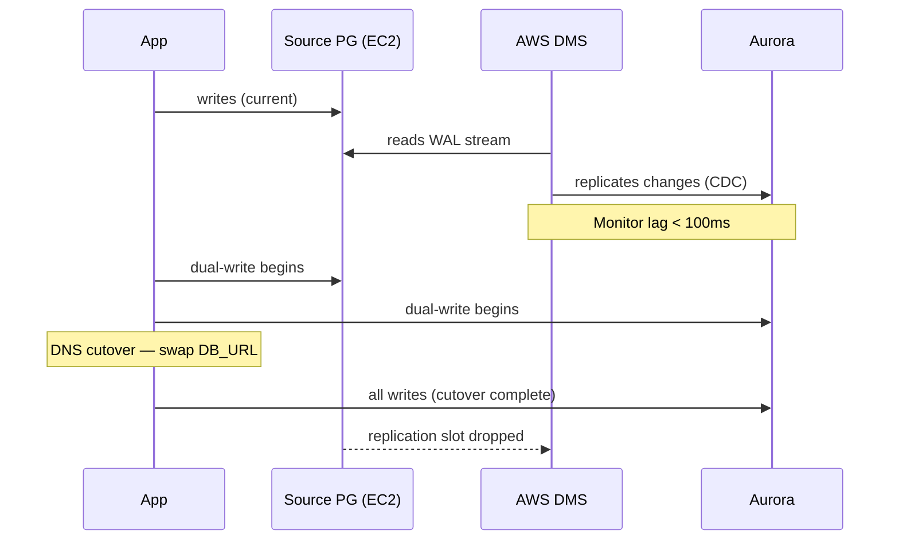
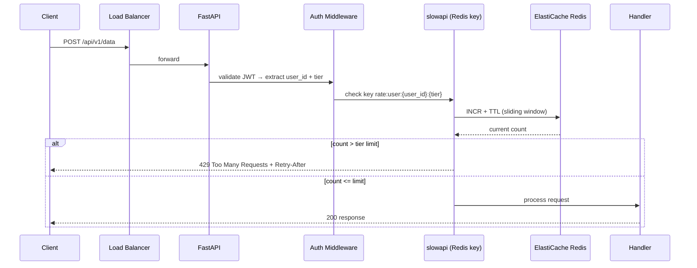

# Planning — Production Scenarios

Two complete planning examples showing the full Nexus Planning Protocol output for real engineering tasks.

---

## Scenario 1 — PostgreSQL to Aurora Migration (50M-row table, zero downtime)

**Input:** "We need to migrate our primary users table (50M rows, ~120GB) from self-managed PostgreSQL 14 on EC2 to Aurora PostgreSQL 15. The service runs 24/7 with no maintenance window. We cannot afford more than 5 seconds of write downtime."

---

### Plan: PostgreSQL → Aurora Migration (Zero-Downtime)

#### Scoping Table

| Task | System Impact | Risk Level | Dependencies | Status |
|------|---------------|------------|--------------|--------|
| Provision Aurora cluster | infra/aurora.tf, IAM roles | Low — provisioning failure isolated; existing DB untouched | None | Proposed |
| Enable logical replication on source PG | postgresql.conf (`wal_level=logical`) | Med — requires PG restart; 30s downtime on source | Aurora cluster running | Proposed |
| Create pglogical/DMS replication slot | source DB, DMS task | Med — replication lag causes stale reads if DMS falls behind | Logical replication enabled | Proposed |
| Verify replica lag < 100ms sustained | CloudWatch DMS metric `CDCLatencyTarget` | High — if lag > 1s at cutover, writes will be lost | DMS task running | Proposed |
| Application dual-write phase | app/db/connection.py, env config | High — any uncaught exception drops write on both sides | Lag verified | Proposed |
| DNS cutover (writer endpoint swap) | Route 53 / app DB_URL env | High — if rollback needed, 60s TTL propagation delay | Dual-write stable for 24h | Proposed |
| Decommission source EC2 PG | infra/ec2.tf | Low — irreversible; do only after 2-week observation | Cutover stable | Proposed |

#### Architecture

#### Trade-off Matrix

| Approach | Downtime | Complexity | Cost | Verdict |
|----------|----------|------------|------|---------|
| pg_dump + restore | ~4 hours | Low | $0 | ❌ fails zero-downtime requirement |
| AWS DMS (CDC) | < 5 seconds | Med | ~$80/mo during migration | ✅ recommended |
| pglogical peer replication | < 1 second | High | $0 | ⚠️ viable but requires PG extension on Aurora |
| Bucardo trigger-based replication | < 1 second | Very High | $0 | ❌ trigger overhead on 50M-row table unacceptable |

#### Implementation Steps

1. `infra/aurora.tf` — add `aws_rds_cluster` resource, Aurora PG 15, Multi-AZ enabled — Depends on: none — Verify: `terraform plan | grep aurora`, `terraform apply`, cluster shows `available`
2. `infra/aurora.tf` — add parameter group with `rds.logical_replication=1` — Depends on: step 1 — Verify: `aws rds describe-db-cluster-parameters --db-cluster-parameter-group-name <name>`
3. Source EC2 PG — set `wal_level=logical` in `postgresql.conf`, rolling restart — Depends on: step 2 — Verify: `psql -c "SHOW wal_level"` returns `logical`
4. AWS Console / CLI — create DMS replication instance + task, full-load + CDC mode — Depends on: step 3 — Verify: DMS task status `Load complete, replication ongoing`
5. CloudWatch — create alarm on `CDCLatencyTarget > 5000ms` for 2 consecutive periods — Depends on: step 4 — Verify: alarm exists, enters OK state within 1 hour
6. `app/db/connection.py` — add dual-write wrapper: write to both PG and Aurora, log any Aurora write failures — Depends on: step 5, lag < 100ms sustained for 4h — Verify: `grep "aurora_write_error" /var/log/app.log | wc -l` returns 0
7. Route 53 / `.env` — update `DATABASE_URL` to Aurora writer endpoint, rolling app restart — Depends on: step 6, dual-write stable for 24h — Verify: `psql $DATABASE_URL -c "SELECT version()"` shows Aurora
8. Remove dual-write code from `app/db/connection.py` — Depends on: step 7, 48h stable — Verify: app unit tests pass
9. `infra/ec2.tf` — remove EC2 PG instance — Depends on: step 8, 2-week observation period — Verify: `terraform plan` shows only destroy on old EC2 resources

#### Validation

- E2E test: `pgbench -c 20 -j 4 -T 300 $AURORA_URL` — assert TPS within 10% of baseline against source PG
- Performance: baseline = source PG p99 write latency; target = Aurora p99 ≤ source + 5ms
- Rollback: if `CDCLatencyTarget` alarm fires at cutover → revert `DATABASE_URL` to source PG writer, restart app — DMS replication resumes automatically

---

## Scenario 2 — API Rate Limiting Feature for FastAPI + Redis Backend

**Input:** "Add per-user rate limiting to our FastAPI service. We have 3 replicas behind a load balancer, so in-memory limits don't work. Use Redis. Limits: 100 req/min for free users, 1000 req/min for paid users."

---

### Plan: API Rate Limiting — FastAPI + Redis (Distributed, Tier-Based)

#### Scoping Table

| Task | System Impact | Risk Level | Dependencies | Status |
|------|---------------|------------|--------------|--------|
| Add slowapi + redis dependencies | `requirements.txt` | Low — install failure blocks deploy but no runtime impact | None | Proposed |
| Provision ElastiCache Redis | `infra/redis.tf`, VPC security groups | Med — Redis in wrong SG = app cannot connect | None | Proposed |
| Add limiter middleware to FastAPI app | `app/main.py` | Med — misconfigured limiter raises 500 on all routes | Redis reachable | Proposed |
| Inject user tier into rate limit key | `app/auth.py`, `app/dependencies.py` | High — wrong tier assignment bills free users at paid rate or throttles paid users | Limiter middleware working | Proposed |
| Apply `@limiter.limit()` to all routes | `app/routers/*.py` (4 files) | Med — missing annotation on one route = unlimited for that route | Tier injection working | Proposed |
| Add 429 error handler with Retry-After header | `app/main.py` | Low — cosmetic; clients can handle 429 without it | Limiter on routes | Proposed |
| Load test to validate limits | local, then staging | Low — read-only test | All above steps | Proposed |

#### Architecture

#### Trade-off Matrix

| Approach | Multi-replica safe | Latency overhead | Cost | Verdict |
|----------|--------------------|------------------|------|---------|
| In-memory (no Redis) | ❌ | 0ms | $0 | ❌ broken across 3 replicas |
| slowapi + Redis | ✅ | +2–4ms p99 | ~$15/mo ElastiCache t3.micro | ✅ recommended |
| Custom Redis INCR script | ✅ | +2ms | ~$15/mo | ⚠️ more control, higher maintenance |
| API Gateway throttling | ✅ | 0ms (offloaded) | ~$3.50/million req | ⚠️ viable if already on APIGW, adds infra layer |

#### Implementation Steps

1. `requirements.txt` — add `slowapi==0.1.9`, `redis==5.0.1` — Depends on: none — Verify: `pip install -r requirements.txt` succeeds
2. `infra/redis.tf` — add `aws_elasticache_cluster` (t3.micro, Redis 7.x), security group allowing port 6379 from app SG — Depends on: none — Verify: `terraform plan | grep elasticache`, cluster endpoint reachable from app: `redis-cli -h <endpoint> ping`
3. `app/main.py` — instantiate `Limiter(key_func=get_user_id_from_token)`, attach to `app.state.limiter`, register `_rate_limit_exceeded_handler` — Depends on: step 1 — Verify: `uvicorn app.main:app --reload` starts without error
4. `app/dependencies.py` — create `get_rate_limit_string()` dependency that returns `"100/minute"` for free tier, `"1000/minute"` for paid — Depends on: step 3 — Verify: unit test `test_rate_limit_string_free()` and `test_rate_limit_string_paid()` pass
5. `app/routers/data.py`, `users.py`, `reports.py`, `admin.py` — add `@limiter.limit(get_rate_limit_string)` to each route — Depends on: step 4 — Verify: `grep -r "@limiter.limit" app/routers/ | wc -l` matches total route count
6. `app/main.py` — add custom 429 handler returning `{"error": "rate_limit_exceeded", "retry_after": N}` — Depends on: step 5 — Verify: `curl -X POST /api/v1/data` 101 times in a loop; 101st returns 429 with `retry_after` field
7. Staging environment — run `locust -f locustfile.py --headless -u 50 -r 10 --run-time 120s` — Depends on: step 6 — Verify: free user hits 429 at request 101, paid user reaches 1000 without throttle

#### Validation

- E2E test: `locust -f locustfile.py --headless -u 50 -r 10 --run-time 120s` with two user classes (free + paid) — assert free user 429s at 101, paid user 429s at 1001
- Performance: baseline = no rate limiting p99; target = +5ms max added by Redis check
- Rollback: if Redis cluster unreachable → set `RATE_LIMIT_BACKEND=memory` in `.env` and restart — note: limits become per-replica (not global) until Redis restored
