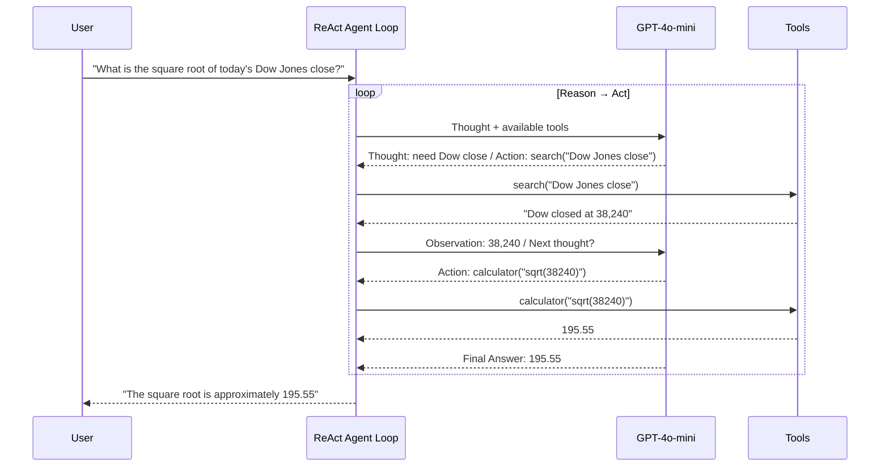

# Tutorial — Production Scenarios

Two real tutorial structures showing the complete cell sequence and content decisions for the Nexus Tutorial Protocol.

---

## Scenario 1 — ReAct Agent with LangChain and OpenAI

**Input:** "Write a tutorial on building a ReAct agent with LangChain and OpenAI."

**Target audience:** Python developers who have used LangChain before but haven't built an agent.
**Prerequisite:** OpenAI API key, Python 3.10+.

---

### Cell Sequence (abbreviated outline)

```
─────────────────────────────────────────────────────
CELL 1 — Shell [code]
─────────────────────────────────────────────────────
python -m venv .venv && source .venv/bin/activate

─────────────────────────────────────────────────────
CELL 2 — pip install [code]
─────────────────────────────────────────────────────
%pip install langchain==0.2.0 langchain-openai==0.1.6 \
             python-dotenv==1.0.1 pydantic-settings==2.2.1

─────────────────────────────────────────────────────
CELL 3 — Config [code]
─────────────────────────────────────────────────────
from pydantic_settings import BaseSettings
from dotenv import load_dotenv

load_dotenv()

class Settings(BaseSettings):
    openai_api_key: str
    model_name: str = "gpt-4o-mini"

    class Config:
        env_file = ".env"

try:
    settings = Settings()
    print(f"Config loaded. Model: {settings.model_name}")
except Exception as e:
    raise ValueError(
        f"Missing required env var: {e}\n"
        "Create a .env file with: OPENAI_API_KEY=sk-..."
    )

─────────────────────────────────────────────────────
CELL 4 — Markdown: H1 Title
─────────────────────────────────────────────────────
# Build a ReAct Agent with LangChain
**Goal:** Build a tool-using agent that reasons before it acts.

─────────────────────────────────────────────────────
CELL 5 — Markdown: Objective
─────────────────────────────────────────────────────
## Objective
You will build a **ReAct** (Reason + Act) agent that can use tools to answer
questions it cannot solve from memory alone. By the end you will have an agent
that searches the web and does math — and you will be able to trace every
reasoning step.

─────────────────────────────────────────────────────
CELL 6 — Markdown: Prerequisites
─────────────────────────────────────────────────────
## Prerequisites
| Requirement | Why |
|-------------|-----|
| `OPENAI_API_KEY` in `.env` | Powers the LLM backbone |
| Python 3.10+ | Required by LangChain 0.2.x |
| ~$0.05 in API credits | Estimated cost to run all cells |

─────────────────────────────────────────────────────
CELL 7 — Markdown: Architecture Diagram
─────────────────────────────────────────────────────
## Architecture



─────────────────────────────────────────────────────
CELL 8 — Markdown: Step 1 — Define Tools
─────────────────────────────────────────────────────
## Step 1 — Define Tools

**Why:** Tools give the agent the ability to act in the world beyond what the LLM
knows from training. Each tool is just a Python function the agent can choose to call.

**Expected output:** Two tool functions defined — no API calls yet.

**Common errors:**
- `TypeError: tool() takes 0 positional arguments` → add `query: str` parameter
- `ValidationError` on tool output → return a plain `str`, not a dict

─────────────────────────────────────────────────────
CELL 9 — Code: Step 1
─────────────────────────────────────────────────────
import math
from langchain_core.tools import tool

@tool
def search(query: str) -> str:
    """Search the web for current information. Use for facts, prices, or events."""
    # In a real tutorial this calls Tavily or SerpAPI.
    # For local testing we return a stub so the cell runs without an extra key.
    return f"[Stub search result for: {query}]"

@tool
def calculator(expression: str) -> str:
    """Evaluate a math expression. Input must be valid Python math (e.g. 'sqrt(38240)')."""
    try:
        result = eval(expression, {"__builtins__": {}}, {"sqrt": math.sqrt, "pow": pow})
        return str(result)
    except Exception as e:
        return f"Error: {e}"

tools = [search, calculator]
print(f"Tools registered: {[t.name for t in tools]}")

─────────────────────────────────────────────────────
CELL 10 — Markdown: Step 2 — Initialize Agent
─────────────────────────────────────────────────────
## Step 2 — Initialize Agent

**Why:** `create_react_agent` wires the prompt template, tools, and LLM into a
single runnable. The ReAct prompt tells the LLM to think step-by-step before acting.

**Expected output:** An `AgentExecutor` object printed to confirm setup.

─────────────────────────────────────────────────────
CELL 11 — Code: Step 2
─────────────────────────────────────────────────────
from langchain import hub
from langchain.agents import create_react_agent, AgentExecutor
from langchain_openai import ChatOpenAI

llm = ChatOpenAI(
    model=settings.model_name,
    api_key=settings.openai_api_key,
    temperature=0,  # deterministic for reproducibility
)

# Pull the standard ReAct prompt from LangChain Hub
prompt = hub.pull("hwchase17/react")

agent = create_react_agent(llm=llm, tools=tools, prompt=prompt)
agent_executor = AgentExecutor(
    agent=agent,
    tools=tools,
    verbose=True,         # prints the Thought / Action / Observation chain
    max_iterations=5,     # prevents infinite loops on ambiguous queries
    handle_parsing_errors=True,
)
print(f"Agent ready: {type(agent_executor).__name__}")

─────────────────────────────────────────────────────
CELL 12 — Markdown: Step 3 — Run Agent
─────────────────────────────────────────────────────
## Step 3 — Run the Agent and Inspect Traces

**Why:** Tracing the Thought → Action → Observation chain reveals whether the agent
is reasoning correctly. `verbose=True` prints every step to stdout.

**Expected output (15–30 seconds):** A block of Thought/Action/Observation lines
ending in "Final Answer: ..."

**Common errors:**
- `RateLimitError` → add `time.sleep(1)` between calls or use a smaller model
- `OutputParserException` → set `handle_parsing_errors=True` (already done above)

─────────────────────────────────────────────────────
CELL 13 — Code: Step 3 (with %%time)
─────────────────────────────────────────────────────
%%time
result = agent_executor.invoke({
    "input": "What is the square root of 38240?"
})
print("\n--- Final Answer ---")
print(result["output"])

─────────────────────────────────────────────────────
CELL 14 — Markdown + Code: Cleanup
─────────────────────────────────────────────────────
## Cleanup

Close the OpenAI client to release connections.

# No persistent connections to close in this notebook.
# If you added a vector store or DB connection above, close it here.
print("Session complete. No cleanup required.")
```

---

## Scenario 2 — REST API Integration with Rate Limiting and Error Handling

**Input:** "Write a tutorial on integrating with a third-party REST API — include authentication, rate limiting, exponential backoff, and error handling."

**Target audience:** Python developers new to production-grade API clients.
**Prerequisite:** Python 3.10+, a free API key from OpenWeatherMap (used as the example API).

---

### Cell Sequence (abbreviated outline)

```
─────────────────────────────────────────────────────
CELL 1 — pip install
─────────────────────────────────────────────────────
%pip install httpx==0.27.0 tenacity==8.3.0 \
             python-dotenv==1.0.1 pydantic-settings==2.2.1

─────────────────────────────────────────────────────
CELL 2 — Pydantic config
─────────────────────────────────────────────────────
class Settings(BaseSettings):
    openweather_api_key: str
    base_url: str = "https://api.openweathermap.org/data/2.5"

─────────────────────────────────────────────────────
CELL 3 — H1 Title + Objective + Prerequisites + Architecture
─────────────────────────────────────────────────────
# Production REST API Integration in Python
## Objective: build a robust API client with auth, retries, and error handling
## Prerequisites:
  - OPENWEATHER_API_KEY in .env (free at openweathermap.org)
  - Python 3.10+
## Architecture (Mermaid):
  Client → rate limiter → httpx (async) → API
                       ↑ tenacity retry on 429/5xx

─────────────────────────────────────────────────────
CELL 4 — Step 1: Base client with auth header injection
─────────────────────────────────────────────────────
Why: centralizing auth in the client means no key ever appears in a request URL or log line.
Expected output: WeatherClient initialized, no network calls yet.

import httpx

class WeatherClient:
    def __init__(self, settings: Settings) -> None:
        self._base_url = settings.base_url
        self._client = httpx.AsyncClient(
            params={"appid": settings.openweather_api_key, "units": "metric"},
            timeout=10.0,
        )

─────────────────────────────────────────────────────
CELL 5 — Step 2: Exponential backoff with tenacity
─────────────────────────────────────────────────────
Why: 429 and 503 are transient — retrying with backoff recovers without manual intervention.
Expected output: a decorated async method that retries up to 4 times.

from tenacity import retry, stop_after_attempt, wait_exponential, retry_if_exception_type

@retry(
    stop=stop_after_attempt(4),
    wait=wait_exponential(multiplier=1, min=1, max=10),
    retry=retry_if_exception_type(httpx.HTTPStatusError),
    reraise=True,
)
async def get_weather(self, city: str) -> dict:
    response = await self._client.get(f"{self._base_url}/weather", params={"q": city})
    response.raise_for_status()  # triggers retry on 4xx/5xx
    return response.json()

─────────────────────────────────────────────────────
CELL 6 — Step 3: Error handling and structured output
─────────────────────────────────────────────────────
Why: callers should receive a typed result, not a raw dict or an unhandled exception.
Expected output: WeatherResult dataclass with temp, description, city.
Common errors:
  - 404: city not found → raise ValueError with a helpful message, not a raw HTTPStatusError
  - 401: bad API key → surface clearly: "Check OPENWEATHER_API_KEY in your .env"

─────────────────────────────────────────────────────
CELL 7 — Step 4: Live call with %%time
─────────────────────────────────────────────────────
%%time
import asyncio

async def main():
    async with WeatherClient(settings) as client:
        result = await client.get_weather("London")
        print(f"London: {result.temp_c}°C, {result.description}")

asyncio.run(main())

─────────────────────────────────────────────────────
CELL 8 — Step 5: Simulate rate limit (429) and verify retry
─────────────────────────────────────────────────────
Why: verifying that retries actually work before production is non-negotiable.
Mock httpx to return 429 twice, then 200 — assert 3 total calls were made.

─────────────────────────────────────────────────────
CELL 9 — Cleanup
─────────────────────────────────────────────────────
await client._client.aclose()
print("HTTP client closed. Session complete.")
```
